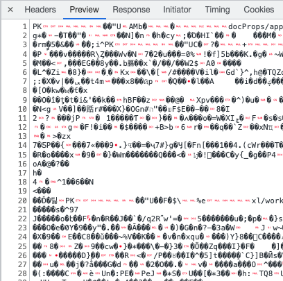
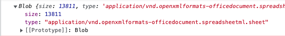

First, the backend API returns the following headers and response:

**Headers**

```json
"content-type": "application/vnd.openxmlformats-officedocument.spreadsheetml.sheet"
"content-disposition": "attachment; filename=file.xlsx"
```

**Example Response**


### 1. API Call

To receive the headers in Blob format, add `responseType: 'blob'` option to Axios requests.

```javascript
const { data, headers } = await api.excelClient.get(url, {
  responseType: 'blob',
})
```

Printing `data` to the console outputs a Blob object like this:


### 2. Creating Blob Object

To create a Blob object from the received response data, use the `content-type` from headers. Default headers accessible from the client are:

- Cache-Control
- Content-Language
- Content-Type
- Expires
- Last-Modified
- Pragma

To access other headers, the server must add them to `Access-Control-Expose-Headers`.

```javascript
const { data, headers } = await api.excelClient.get(url, {
  responseType: 'blob',
})
const blob = new Blob([data], {
  type: headers['content-type'],
})
```

### 3. Download Using `<a>` Tag

Use [createObjectURL](https://developer.mozilla.org/ko/docs/Web/API/URL/createObjectURL) to generate a URL pointing to the created Blob object, and set it as the `href` attribute of `<a>` tag.

Use the [download](https://www.w3schools.com/tags/att_a_download.asp) attribute of `<a>` tag to set the file name.

Finally, use [revokeObjectURL](https://developer.mozilla.org/ko/docs/Web/API/URL/revokeObjectURL) to release the object URL.

```javascript
const { data, headers } = await api.excelClient.get(`/api/excel-download`, {
  responseType: 'blob',
})
const blob = new Blob([data], {
  type: headers['content-type'],
})
const blobUrl = URL.createObjectURL(blob)
const link = document.createElement('a')
link.href = blobUrl
link.download = `file.xlsx` // The extension .xlsx will be added automatically
link.click()
URL.revokeObjectURL(blobUrl)
```

### +) Setting File Name Using content-disposition

If `content-disposition` is exposed in `Access-Control-Expose-Headers` by the server, you can use the specified file name for download.

```json
"content-disposition": "attachment; filename=file.xlsx"
```

```javascript
const { data, headers } = await api.excelClient.get(`/api/excel-download`, {
  responseType: 'blob',
})
const blob = new Blob([data], {
  type: headers['content-type'],
})
const blobUrl = URL.createObjectURL(blob)
const link = document.createElement('a')
link.href = blobUrl
// Get the file name
const filename = headers['content-disposition']
  .split('filename=')[1]
  .split('.')[0]
link.download = filename // The extension .xlsx will be added automatically
link.click()
URL.revokeObjectURL(blobUrl)
```
