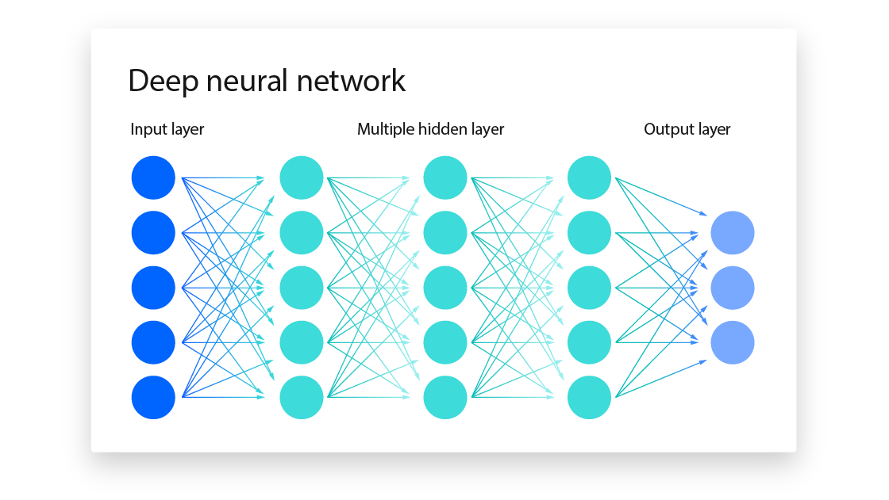
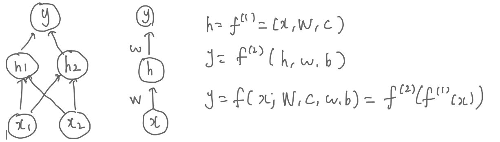
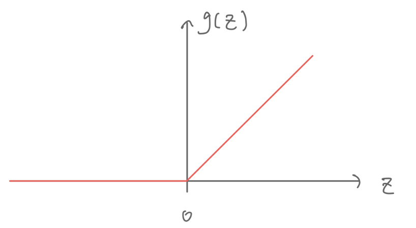
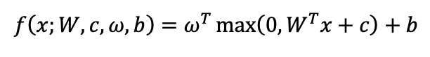
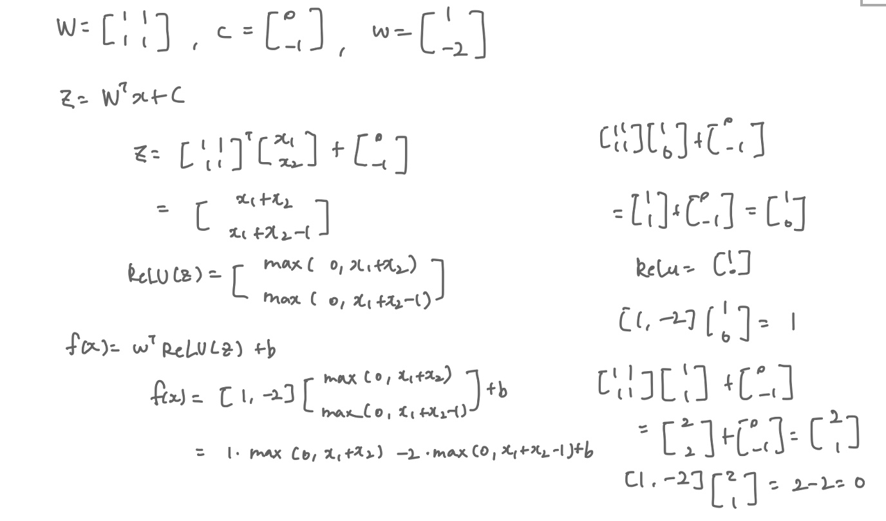
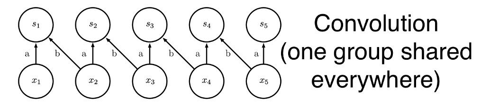
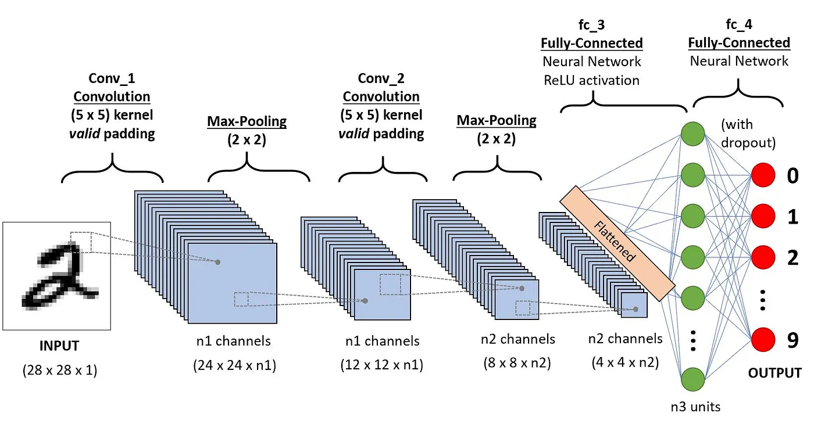
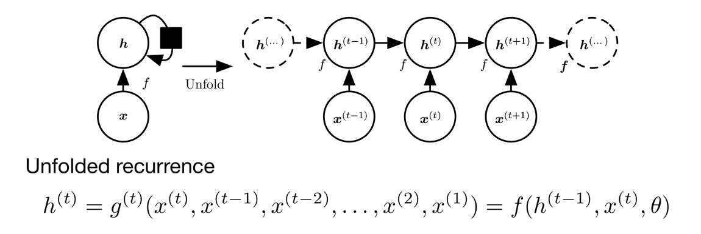
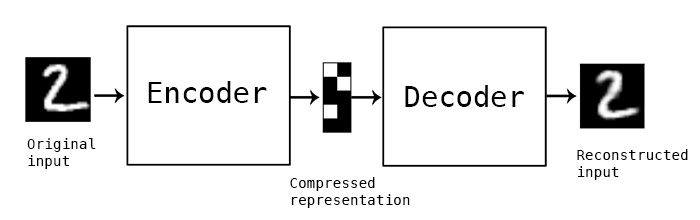

# Motivation
I'm pursuing a Master's in Embedded and Cyber-Physical Systems at UCI and took a machine learning course this quarter.
Through this course, I discovered my interest in ML and AI and want to share my knowledge about neural networks.

# Neural Network

## What is a neural network?

A neural network is a computational model inspired by the human brain. It consists of neurons (nodes) and connections (edges) between them, similar to how biological neurons are interconnected. Each neuron holds a value, and connections between neurons are associated with weights, which determine how much influence one neuron has on another.

A typical neural network is structured in layers:

- Input layer: Receives raw data.
- Hidden layers: Process information through weighted connections and activation functions.
- Output layer: Produces the final result.

The **depth** of a network refers to the number of layers, and the **width** refers to the number of neurons in each layer. While deeper networks can capture more complex patterns, performance improvement is not always guaranteed—it depends on factors like architecture, data, and optimization techniques.

When data flows through the network, computations such as matrix multiplications, linear transformations, and activation functions (e.g., ReLU, sigmoid) occur to introduce non-linearity, helping the network learn complex patterns.

## Learning XOR  

To understand how a neural network works, solving the XOR problem is a great example.  

### XOR (Exclusive OR)  

The XOR function operates on two binary inputs, x1 and x2. It outputs **1** when exactly one of the inputs is **1**, otherwise it outputs **0**.  

| x1 | x2 | XOR Output |
|:------:|:------:|:-----------:|
| 0      | 0      | 0           |
| 0      | 1      | 1           |
| 1      | 0      | 1           |
| 1      | 1      | 0           |

XOR is **not linearly separable**, meaning a single-layer perceptron (i.e., a linear model) cannot solve it.

---

### Neural Network Solution  

- Instead of trying to separate XOR linearly, we **transform the input space** into a new feature space where a linear model can represent the solution.  
- A simple **feedforward neural network** with **one hidden layer** containing **two neurons** can solve XOR.  

    

- The key is using a **non-linear transformation** (activation function) to allow the network to learn a separable feature space.  

---

### Activation Function: ReLU  

- Activation functions introduce **non-linearity**, allowing neural networks to learn complex patterns.  
- One commonly used activation function is the **Rectified Linear Unit (ReLU)**:  
  
  g(z) = max(0, z)

    

- Other options include **sigmoid** and **tanh**, but ReLU is often preferred due to its efficiency and ability to reduce the vanishing gradient problem.

---

### Final XOR Solution  

- After training, the neural network finds the correct decision boundary.  
- The entire network can be represented mathematically as:  

  

- The final network solution, expressed in terms of matrix multiplication, is:  

   

  The network successfully models XOR by learning a **non-linear representation**, enabling correct classification.

# CNN (Convolutional Neural Network)  

## **What is CNN?**  
- A **specialized neural network** designed for processing data with a **grid-like structure** (e.g., images).  
- The core of CNNs is the **convolution operation**, which will be explained in the next section.  
- CNNs replace traditional **fully connected layers** with **convolutional layers**, reducing the number of parameters and making the network more efficient.

---

## **Convolution**  
  

Convolution leverages three important ideas that enhance machine learning models:  
1. **Sparse interactions**  
2. **Parameter sharing**  
3. **Equivariant representations**  

---

### **1. Sparse Interactions**  
- Traditional neural networks use **matrix multiplication**, where **every unit interacts with every other unit**, requiring a large number of parameters and operations.  
- **Convolutional layers** introduce **sparse interactions** by using small filters (kernels) instead of fully connected layers.  
- **Example:** In image processing, instead of analyzing millions of pixels at once, CNNs detect small, meaningful patterns (e.g., edges) using **small filters**.  

---

### **2. Parameter Sharing**  
- **Definition:** Using the **same parameter** for multiple computations in a model.  
- **In traditional neural networks**, each weight in the matrix is used **only once**.  
- **In CNNs**, the **same set of weights (kernel)** is applied across **all spatial locations** → **"tied weights"**.  

---

### **3. Equivariance**  
- **Definition:** A function is **equivariant** if applying a transformation to the input produces the same transformation in the output. $ f(g(x)) = g(f(x)) $
- **Convolution is equivariant to translation** → If an object moves in an image, the CNN will **detect it in the new position** without retraining.  
- Example: If a CNN detects an edge in one part of an image, it will also detect the same edge if it appears elsewhere.  

---

CNNs leverage **convolution, parameter sharing, and equivariance** to efficiently process structured data like images. These properties make CNNs **powerful for tasks such as image classification, object detection, and more.**

## **Typical Layer of a CNN**  

A typical **Convolutional Neural Network (CNN) layer** consists of **three main stages**:  

1. **Convolution** → Multiple parallel convolutions are applied to obtain **linear activations**.  
2. **Detector (Activation Function)** → The activations are passed through a **non-linear activation function** (e.g., **ReLU**).  
3. **Pooling** → A **pooling function** modifies the output to improve efficiency and robustness.  

---

## **Pooling**  

Pooling **summarizes** nearby outputs by replacing values with a **statistical measure**.  

### **Types of Pooling**  
- **Max pooling** → Takes the **maximum** value within a rectangular neighborhood.  
- **Average pooling** → Computes the **average** within a rectangular neighborhood.  
- **Weighted average pooling** → Computes a **weighted** sum of values in a region.  
- **L2 norm pooling** → Uses the **L2 norm** to summarize values.  

### **Why Use Pooling?**  
✅ **Reduces sensitivity to small translations** → Small shifts in the input do not drastically change the output.  
✅ **Improves computational efficiency** → Reduces the number of parameters and operations.  
✅ **Provides invariance** → Helps the model generalize by making it less dependent on exact positions.  

### **Observations on Pooling**  
- Pooling acts as a **strong prior**, enforcing **invariance to small translations**.  
- **Cross-channel pooling** → When applied across outputs of different convolutions, it helps **learn which transformations to be invariant to**.  
- **Pooling with downsampling** → Instead of pooling every pixel, **pooling regions spaced \( k \) pixels apart** improve computational efficiency.  
- Essential for handling **variable-sized inputs** in tasks like **object detection and segmentation**.  
- Enables obtaining a **fixed-size input** for the classification layer by varying pooling region offsets.  

# RNN (Recurrent Neural Network)

## What is RNN?  
- A type of neural network designed for **sequential data**.  
- Unlike traditional feedforward neural networks, RNNs have loops that allow information to persist across time steps.  
- Useful for tasks like **time series analysis, speech recognition, and natural language processing (NLP)**.  

## How RNN Works  

At each time step $t$, an RNN takes an input $x_t$ and maintains a hidden state $h_t$, which stores information from previous time steps.  

The hidden state is updated using the equation:  

$$
h_t = f(W_h h_{t-1} + W_x x_t + b)
$$

where:  
- $h_t$ is the hidden state at time $t$  
- $W_h$ and $W_x$ are weight matrices  
- $b$ is the bias  
- $f$ is an activation function (e.g., tanh or ReLU)  

The final output is computed using:  

$$
y_t = W_y h_t + b_y
$$

## Challenges of RNN  
### 1. Vanishing Gradient Problem  
- In long sequences, gradients become **very small**, making it difficult for RNNs to learn long-term dependencies.  
- Solution: Use architectures like **LSTM (Long Short-Term Memory)** or **GRU (Gated Recurrent Unit)**.  

### 2. Exploding Gradient Problem  
- Opposite of vanishing gradients: gradients become **too large**, causing instability.  
- Solution: Apply **gradient clipping** to limit the gradient values.  

## Variants of RNN  
### 1. **LSTM (Long Short-Term Memory)**  
- Introduces **gates** (forget, input, and output gates) to control the flow of information.  
- Helps retain long-term dependencies.  

### 2. **GRU (Gated Recurrent Unit)**  
- A simpler alternative to LSTM with fewer parameters.  
- Uses **update** and **reset gates** to manage information flow.  

## Applications of RNN  
- **Speech Recognition** (e.g., Siri, Google Assistant)  
- **Machine Translation** (e.g., Google Translate)  
- **Time Series Forecasting** (e.g., stock price prediction)  
- **Text Generation** (e.g., chatbots, AI writing assistants)  

## Autoencoder

### What is an Autoencoder?

- Autoencoders are neural networks trained to attempt to copy their input to their output.
- Internally, they have a hidden layer $h$ that describes a code used to represent the input.
- The network is composed of two parts:
  - **Encoder function**
  - **Decoder function**
- Autoencoders are a special case of feedforward networks and can be trained using the same techniques.

- The goal is not to focus on the output of the autoencoder, but rather to encode useful properties in $h$.
- We aim to represent the input with a smaller dimension than $x$, capturing the most salient features of the training data.

### Training Process
- During training, we minimize the loss function.
- The loss function $L$ penalizes $g(f(x))$ for being dissimilar to $x$.

### Linear vs. Nonlinear Autoencoders
- **Linear Autoencoder**: If a linear autoencoder uses Mean Squared Error (MSE) as $L$, it can learn similar representations to Principal Component Analysis (PCA).
  - A linear autoencoder with a simple MSE loss is very similar to PCA because both methods seek to represent the input data in a lower-dimensional space.
  - PCA finds the principal components of the data, and a linear autoencoder with MSE loss learns a similar transformation by capturing the principal components.
  
- **Nonlinear Autoencoder**: A nonlinear autoencoder can learn a more powerful nonlinear generalization of PCA, allowing it to capture more complex relationships in the data.

### Applications of Autoencoders

#### Dimensionality Reduction
- One of the most traditional applications of autoencoders (AEs).
- Deep autoencoders with gradually smaller layers can achieve dimensionality reduction.
- They are often better and more interpretable than PCA.
- Lower-dimensional representations can improve classification performance, reduce the overall model size, and increase the interpretability of classification results.

#### Information Retrieval
- Autoencoders can be used for finding entries in a database that resemble a given query entry.
- This allows for more efficient search operations.
- In some cases, the encoder can be trained to output binary codes (by using sigmoid units in the final layer).
- Entries in the database that share the same code are returned, a technique called **semantic hashing**.

# References
- https://medium.com/data-science/a-comprehensive-guide-to-convolutional-neural-networks-the-eli5-way-3bd2b1164a53
- https://www.ibm.com/think/topics/neural-networks
- https://blog.keras.io/building-autoencoders-in-keras.html
- https://achyuthabharadwaj.github.io/Intro-to-ML-4/

