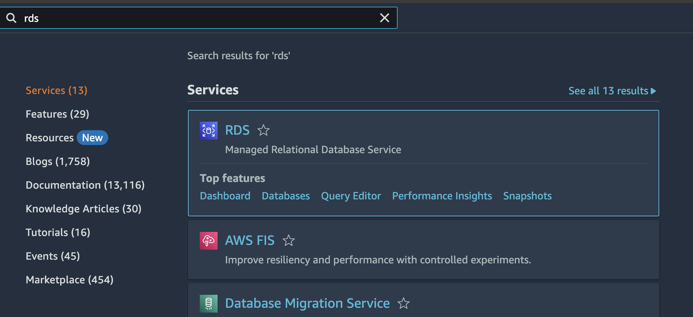
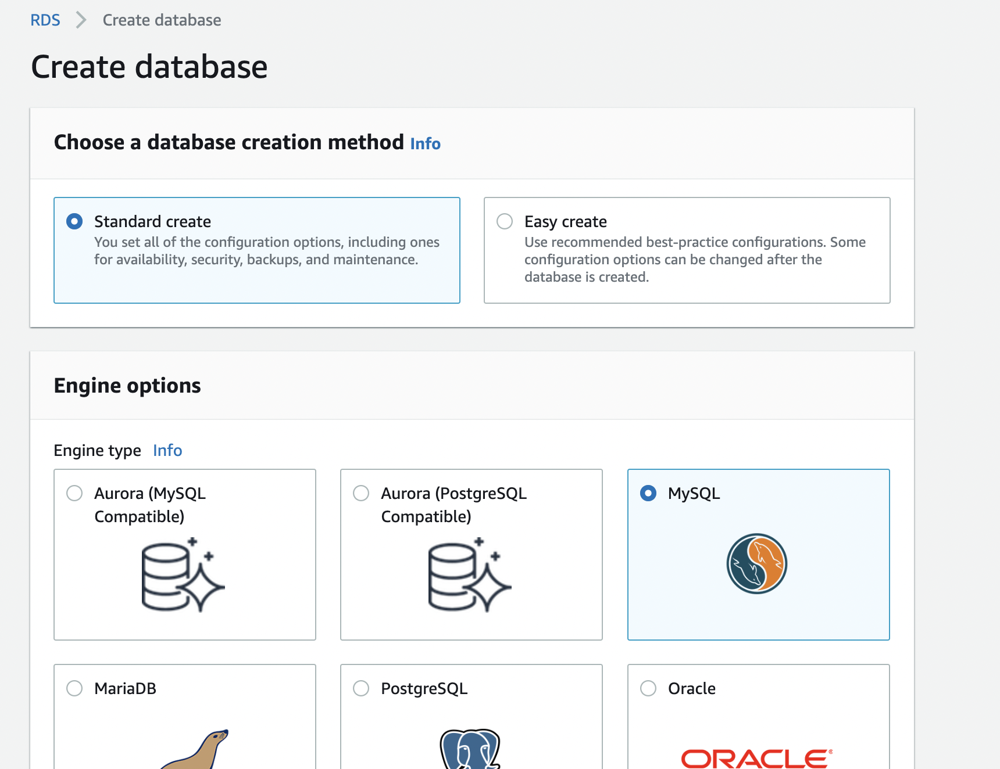
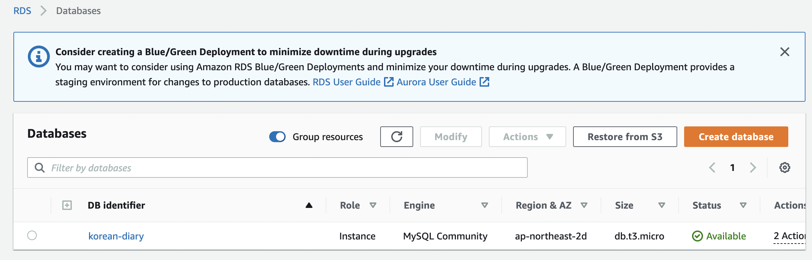
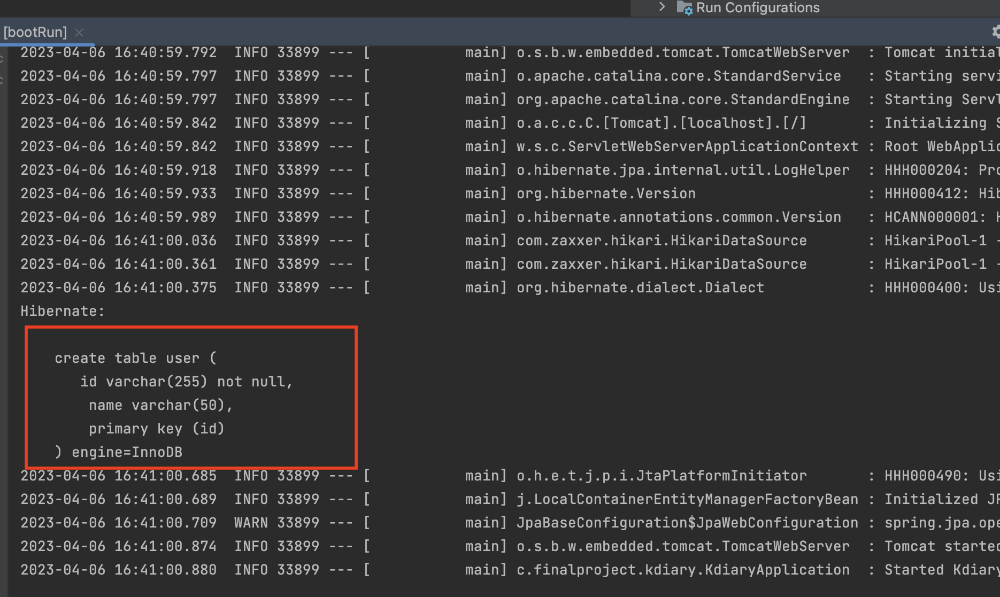

1. Creating RDS Instance

   First, navigate to the AWS console and search for RDS.

   

   Click on "Create database" to begin setting up.

   

   In the setup, choose your preferred database engine (MySQL in this example).

   

   Specify a DB instance identifier and set a master password. Ensure it's at least 5 characters long (you'll need this for MySQL Workbench later).

   

   Enable Public access and leave the security group settings as default for now. You can modify these after creating the database.

   

   Since this is for testing purposes, select "Free tier" for Template.

   

   Once all settings are configured, review and create the RDS DB instance. After creation, click on the DB name to view details.

   

   Click on the security group highlighted in red to modify the inbound rules.

   

   Under the inbound rules tab, click "Edit inbound rules".

   

   Add a rule to open port 3306 for MySQL as shown below.

   

2. Checking with MySQL Workbench

   Next, verify connection from MySQL Workbench. Use the Endpoint of the DB created earlier, username as admin, and the password you set.

   

   If configured correctly, you should successfully connect as shown below.

   

   Now, let's add a database schema for your project. Define the schema name and encoding settings as per your requirements.

   

3. Connecting with Spring Boot Project

   Finally, integrate your Spring Boot project with the database.

   Let's add a simple User table (assuming the model is already designed):

   ```java
   package com.finalproject.kdiary.domain.model;

   import lombok.NoArgsConstructor;

   import javax.persistence.*;
   import java.util.UUID;

   @NoArgsConstructor
   @Entity
   @Table(name="user")
   public class User {

       @Id
       private String id = UUID.randomUUID().toString();

       @Column(length = 50)
       private String name;

       // getters and setters
   }
   ```

   Add the necessary dependencies in `build.gradle`:

   ```groovy
   dependencies {
       implementation 'org.springframework.boot:spring-boot-starter-data-jpa'
       implementation 'mysql:mysql-connector-java:8.0.32'
   }
   ```

   Finally, add the database configuration to `application.properties`. Ensure this file is added to `.gitignore` for security.

   ```properties
   spring.datasource.url=jdbc:mysql://{{endpoint}}:3306/{{DB_name}}?useSSL=false&useUnicode=true&allowPublicKeyRetrieval=true&serverTimezone=Asia/Seoul
   spring.datasource.username=admin
   spring.datasource.password={{password}}
   spring.datasource.driver-class-name=com.mysql.cj.jdbc.Driver
   spring.jpa.show-sql=true
   spring.jpa.hibernate.ddl-auto=update
   spring.jpa.properties.hibernate.format_sql=true
   ```

   When you run your project, you should see logs indicating that the tables are being created.

   

   Verify in MySQL Workbench that the User table has been created.

   
