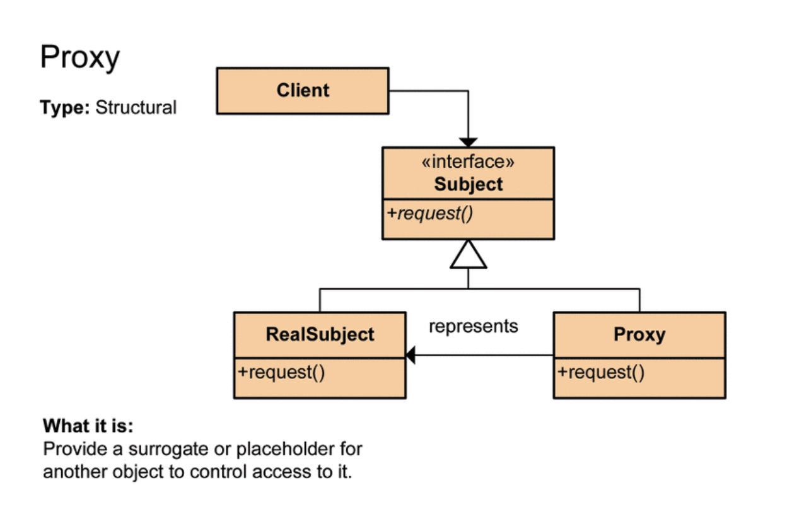
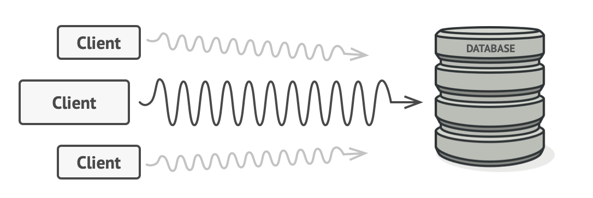
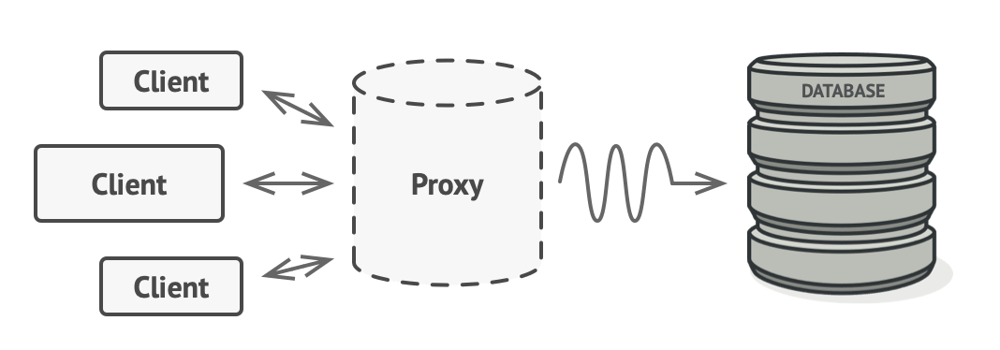

# Pros and Cons of ORM

## ORM

- Object-relational mapping (ORM)
- Objects are designed as objects
- Relational databases are designed as relational databases
- ORM framework maps between them
- It means that we connect (map) the application class and the RDB table we usually understand, and technically auto-persist the application's objects to the RDB table.

## Pros

- You can manipulate the DB using methods other than SQL statements, so developers can focus only on configuring business logic using the object model. (Internally, it creates queries to manipulate the DB, but developers don't have to worry about this.)
- Secondary code such as necessary declaration statements and assignments is reduced, increasing the readability of the code by writing separate codes for various objects.
- It is possible to write object-oriented code, so productivity is increased.
- Mapping information is explicitly indicated as a class, so it is possible to lower the dependency on viewing the ERD, making maintenance and refactoring advantageous.

## Cons

- The cost of learning is high.
- If the project is large and complex, incorrect design may lead to speed reduction and inconsistency.
- Complex and business logic dependent queries may require separate tuning for speed, so ultimately you may need to write SQL statements.

# @DynamicUpdate

When the `save()` method is executed in the repository, the default behavior of JPA is to include columns that have not changed in the update query. `@DynamicUpdate` is a feature that creates an update query only with columns whose actual values have changed.

```java
@Entity
@DynamicUpdate
@TypeDef(name = "order_status", typeClass = PostgreSQLEnumType.class)
public class PizzaOrder {
    @Id
    private Integer id;

    @Enumerated(EnumType.STRING)
    @Column(columnDefinition = "post_status_info")
    @Type(type = "order_status")
    private OrderStatus status;

    @CreationTimestamp
    private Timestamp orderTime;

    public enum OrderStatus {
        Ordered,
        Baking,
        Delivering,
        YummyInMyTummy
    }
}
```

In the example above, when ordering pizza, when the pizza owner accepts the order, the order status should change from Ordered to Baking. When `repository.save(pizzaOrder)` is executed, Hibernate generates the following SQL query:

```SQL
Hibernate:
    update
        pizza_order
    set
        order_time=?,
        status=?
    where
        id=?
```

You can see that even the unchanged `order_time` is included in the UPDATE statement.

Let's add the `@DynamicUpdate` annotation as follows:

```java
@Entity
@DynamicUpdate
@TypeDef(name = "order_status", typeClass = PostgreSQLEnumType.class)
public class PizzaOrder {
    // The rest of the implementation
}
```

When `repository.save(pizzaOrder)` is executed, Hibernate generates an SQL query that excludes the update of `order_time`, as shown below:

```sql
Hibernate:
    update
        pizza_order
    set
        status=?
    where
        id=?
```

# Regular Expressions

> Regular expressions (RegEx) are a format language derived from computer science to represent a set of strings with specific rules.

During development, there are cases where specific formats such as phone numbers, resident registration numbers, emails, etc., are required, and it is necessary to verify whether users have entered them correctly according to these formats. When verifying such input values against predefined formats, regular expressions can be used to implement this validation easily.

## How to Write Regular Expressions

To write regular expressions in Java, you should use the java.util.regex package APIs. When using regular expressions in Java, the Pattern class and Matcher class in the java.util.regex package are primarily used.

### Pattern Class

The functionality of verifying the target string against a regular expression can be achieved using the matches() method of the java.util.regex.Pattern class. The first parameter of the matches() method is the regular expression, and the second parameter is the target string to be verified. If the target string matches the regular expression, it returns true; otherwise, it returns false.

```java
import java.util.regex.Pattern;

public class RegexExample {
    public static void main(String[] args)  {

            String pattern = "^[0-9]*$"; // Numbers only
            String val = "123456789"; // Target string

            boolean regex = Pattern.matches(pattern, val);
            System.out.println(regex);
    }
}
```

### Matcher Class

The Matcher class is mainly used when interpreting the pattern of the target string and determining whether it matches the given pattern. The Matcher class uses a new interface called CharSequence, which supports character-by-character matching from various forms of input data. You can obtain a Matcher object by calling the matcher() method of the Pattern object.

```java
import java.util.regex.Matcher;
import java.util.regex.Pattern;

public class RegexExample {
    public static void main(String[] args) {
        Pattern pattern = Pattern.compile("^[a-zA-Z]*$"); // Alphabets only
        String val = "abcdef"; // Target string
        Matcher matcher = pattern.matcher(val);
        System.out.println(matcher.find());
    }
}
```

## Validation Example

```java
import java.util.regex.Pattern;

public class RegexExample {
    public static void main(String[] args)  {
          String name = "홍길동";
          String tel = "010-1234-5678";
          String email = "test@naver.com";

          // Validation
          boolean name_check = Pattern.matches("^[가-힣]*$", name);
          boolean tel_check = Pattern.matches("^01(?:0|1|[6-9])-(?:\\d{3}|\\d{4})-\\d{4}$", tel);
          boolean email_check = Pattern.matches("\\w+@\\w+\\.\\w+(\\.\\w+)?", email);

          // Output
          System.out.println("Name : " + name_check);
          System.out.println("Phone number : " + tel_check);
          System.out.println("Email : " + email_check);
    }
}
```

## Regex Related Sites

Using sites like the one below makes it easy to create and verify regular expressions:
https://regexr.com

# Proxy

> The proxy means 'agent,' which means to delegate something to the proxy.
> For example, in the security field, a server that serves as an intermediary between the server and the client-side to avoid exposing the server to the outside world for security reasons is called a proxy server.

## What is the Proxy Pattern?

It is one of the design patterns, meaning a class that serves as an interface connecting to something else.
Instead of an object being placed in place of the class to be used and executed using an interface, a delegate object is substituted for the actual execution class, and the client either calls the method of the actual execution class or calls the method of the delegate object without knowing it.



As shown in the diagram above, when the client calls the request() of the Subject interface, the request() of the RealSubject implementation class is called.
At this point, the proxy calls the request() method of the RealSubject on behalf of it and delivers the return value to the client.

Let's implement the above diagram in code.

```java
public interface Subject {
    String request();
}
```

```java
public class RealSubject implements Subject {

    @Override
    public String request() {
        return "HelloWorld";
    }
}
```

```java
public class Proxy implements Subject {

    private final RealSubject realSubject = new RealSubject();

    @Override
    public String request() {
        return realSubject.request();  // Proxy calls the method of the actual class.
    }

}
```

```java
public class Main {

    public static void main(String[] args) {
        // Calls the method of the Proxy class instead of the Subject class.
        Subject subject = new Proxy();
        System.out.println(subject.request()); // Internally calls the method of Subject.

    }
}
```

In this way,

1. Due to the interface, development code is not affected by the implementation.
2. Instead of directly accessing the implementation class, access is redirected through Proxy (flow control).

## Why Use the Proxy Pattern?

It allows flow control. So why do you need flow control?

Consider a situation without using a proxy object like the picture below.

In situations requiring a large amount of resources, DB queries can be significantly slow.
In such cases, you need to write code for lazy initialization, and if you directly put it in each class, there will be a huge amount of code duplication.

Therefore, by using a proxy object like in the picture below, the proxy object receives the request first and controls the flow so that it can execute operations only when the DB queries are executed.



1. You can add necessary functions (preprocessing, etc.) before the actual method is called.
2. You can use caching.
