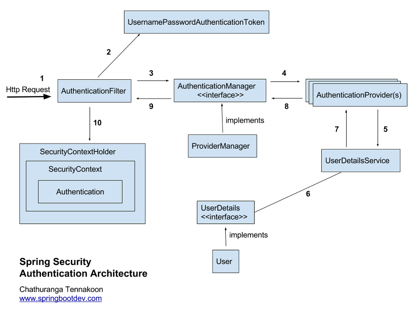

## 1. What is Spring Security?

Spring Security is a sub-framework of Spring that handles authentication and authorization in Spring-based applications.

- Authentication refers to logging in.
- Authorization refers to what an authenticated user can do.

Spring Security provides a systematic set of options related to security, eliminating the need for developers to manually write security-related logic.

Spring Security handles authentication and authorization through the **Filter** flow.

Filters intercept requests before they reach the DispatcherServlet, making them the first to receive URL requests within the web container. Interceptors, on the other hand, sit between the Dispatcher and the Controller, managed within the Spring container.

Client (request) → Filter → DispatcherServlet → Interceptor → Controller
(Interceptors do not delegate requests to the Controller directly; they pass through the Interceptor first)

## 2. Spring Security Workflow



The processing steps of Spring Security can be summarized as follows:

1. The user sends an authentication request along with login information (HTTP Request).
2. The AuthenticationFilter intercepts the request and creates an authentication object, UsernamePasswordAuthenticationToken, using the intercepted information.
3. The AuthenticationFilter passes the created UsernamePasswordToken object to the ProviderManager, the implementation of AuthenticationManager.
4. AuthenticationManager queries the registered AuthenticationProviders to initiate the authentication process.
5. UserDetailsService, which retrieves user authentication information from the actual database, receives the user information.
6. Using the received user information, UserDetails object is created by fetching user information from the database.
7. AuthenticationProviders receive UserDetails and compare user information.
8. Upon successful authentication, an Authentication object containing user information such as roles is returned.
9. The Authentication object returned by AuthenticationProvider is sent back to the initial AuthenticationFilter.
10. The Authentication object is stored in the SecurityContext by SecurityContextHolder.

Ultimately, SecurityContextHolder stores the Authentication object in the session area of the SecurityContext, indicating that Spring Security uses traditional session-cookie-based authentication.

## 3. Key Module Descriptions

### Authentication

The object returned after the authentication process.

> 8. Upon successful authentication, an Authentication object containing user information such as roles is returned.
> 9. The Authentication object returned by AuthenticationProvider is sent back to the initial AuthenticationFilter.

This interface encapsulates the information and roles of the current user. Authentication objects are stored in the SecurityContext and can be accessed through SecurityContextHolder.

```java
public interface Authentication extends Principal, Serializable {
// Retrieves the current user's list of authorities
Collection<? extends GrantedAuthority> getAuthorities();

 // Retrieves credentials (typically passwords)
Object getCredentials();

 Object getDetails();

    // Retrieves the Principal object
    Object getPrincipal();

    // Retrieves whether the user is authenticated
    boolean isAuthenticated();

    // Sets whether the user is authenticated
    void setAuthenticated(boolean isAuthenticated) throws IllegalArgumentException;

}
```

### UsernamePasswordAuthenticationToken

> 2. AuthenticationFilter intercepts the request and creates an authentication object, UsernamePasswordAuthenticationToken, using the intercepted information.
> 3. AuthenticationManager's implementation, ProviderManager, is passed the created UsernamePasswordToken object.

UsernamePasswordAuthenticationToken is a subclass of AbstractAuthenticationToken that implements Authentication, where the User's ID serves as the Principal and the Password as the Credential. The first constructor of UsernamePasswordAuthenticationToken creates an object before authentication, while the second creates an object after authentication.

```java
public abstract class AbstractAuthenticationToken implements Authentication, CredentialsContainer {
}

public class UsernamePasswordAuthenticationToken extends AbstractAuthenticationToken {

    private static final long serialVersionUID = SpringSecurityCoreVersion.SERIAL_VERSION_UID;

    // Represents the User's ID
    private final Object principal;

    // Represents the User's password
    private Object credentials;

    // Creates an object before authentication
    public UsernamePasswordAuthenticationToken(Object principal, Object credentials) {
    	super(null);
    	this.principal = principal;
    	this.credentials = credentials;
    	setAuthenticated(false);
    }

    // Creates an object after authentication
    public UsernamePasswordAuthenticationToken(Object principal, Object credentials,
    		Collection<? extends GrantedAuthority> authorities) {
    	super(authorities);
    	this.principal = principal;
    	this.credentials = credentials;
    	super.setAuthenticated(true); // must use super, as we override
    }

}
```

### AuthenticationManager

> 4. AuthenticationManager queries the registered AuthenticationProvider(s) to initiate the authentication process.

AuthenticationManager handles authentication, where actual processing is delegated to the AuthenticationProviders registered with it. Upon successful authentication, an object is created using the second constructor and stored in SecurityContext.

```java
public interface AuthenticationManager {

    Authentication authenticate(Authentication authentication) throws AuthenticationException;

}
```

### AuthenticationProvider

AuthenticationProvider handles actual authentication. It receives an Authentication object before authentication and returns an authenticated object. Custom AuthenticationProviders can be implemented by following this interface and registering them with AuthenticationManager.

```java
public interface AuthenticationProvider {

    Authentication authenticate(Authentication authentication) throws AuthenticationException;

    boolean supports(Class<?> authentication);

}
```

### ProviderManager

ProviderManager, implementing AuthenticationManager, manages a list of AuthenticationProviders.

```java
public class ProviderManager implements AuthenticationManager, MessageSourceAware, InitializingBean {

    public List<AuthenticationProvider> getProviders() {
		return this.providers;
	}
    
    public Authentication authenticate(Authentication authentication) throws AuthenticationException {
		Class<? extends Authentication> toTest = authentication.getClass();
		AuthenticationException lastException = null;
		AuthenticationException parentException = null;
		Authentication result = null;
		Authentication parentResult = null;
		int currentPosition = 0;
		int size = this.providers.size();
        
        // Iterate through all providers using a for-loop until a result is obtained
		for (AuthenticationProvider provider : getProviders()) { ... }
	}
}
```

### UserDetailsService

> 5. UserDetailsService, which retrieves user authentication information from the actual database, receives the user information.

UserDetailsService has a single method that returns UserDetails objects. Typically, classes implementing this interface inject UserRepository to connect to the database and process information.

```java
public interface UserDetailsService {

    UserDetails loadUserByUsername(String username) throws UsernameNotFoundException;

}
```

### UserDetails

> 6. Using the received user information, UserDetails object is created by fetching user information from the database.
> 7. AuthenticationProviders receive UserDetails and compare user information.

Upon successful authentication, UserDetails objects are used to create UsernamePasswordAuthenticationToken, implementing Authentication objects. UserDetails can be implemented to process authentication.

```java
public interface UserDetails extends Serializable {

    // List of authorities
    Collection<? extends GrantedAuthority> getAuthorities();

    String getPassword();

    String getUsername();

    // Checks if the account is not expired
    boolean isAccountNonExpired();

    // Checks if the account is not locked
    boolean isAccountNonLocked();

    // Checks if the credentials are not expired
    boolean isCredentialsNonExpired();

    // Checks if the user is enabled
    boolean isEnabled();

}
```

### SecurityContextHolder

SecurityContextHolder stores detailed information about the security context of the application, including information about the security principal.

### SecurityContext

> 10. Authentication objects are stored in the SecurityContext.

It manages Authentication objects and allows storing or retrieving them through SecurityContext.

```java
SecurityContextHolder.getContext().setAuthentication(authentication);
SecurityContextHolder.getContext().getAuthentication(authentication);
```

### GrantedAuthority

GrantedAuthority represents the authorities (roles) granted to the current user (Principal), typically in the form of ROLE*\*ADMIN or ROLE*\*USER. GrantedAuthority objects can be retrieved through UserDetailsService to check whether specific permissions exist for accessing resources.

## Reference

https://dev-coco.tistory.com/174
