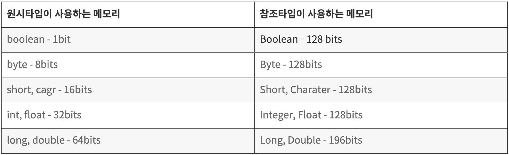

- [Literal](#리터럴literal)
- [this, this()](#this-this)
- [super, super()](#super-super)
- [Java's Primitive and Reference Types](#자바의-원시-타입-참조-타입)

## Literal

### What is a Literal?

In Java, a literal represents a constant value that can be assigned to a variable. Literals denote fixed values and are immutable. They are syntactic representations of boolean, character, numeric, and string data.

```java
int count = 0;
```

In the above code, `int count` is a variable of type int, and `0` is a literal.

### Types of Literals

1. Integral Literals
   Integral literals include decimal (e.g., 1, 2, 6, 9), octal, hexadecimal, and binary representations.

   ```java
   int count = 987;

   int octalVal = 007;

   int hexaVal = 0x7e4;

   int binary = 0b11010;
   ```

2. Floating-Point Literals
   Floating-point literals represent values with a fractional component. They can be expressed as float (4 bytes) with a trailing **f** or **F**, or as double (8 bytes) with a trailing **d** or **D**. Decimal format without d or f can also be used, and this decimal format can be used with the exponent symbol **-** or **e**, **E**.

   ```java
   float floatVal = 4534.99f;

   double doubleVal = 19765.567;

   float expVal = 122.32E5;
   ```

3. Char Literals
   Character literals include escape characters (e.g., \n, \r), single characters enclosed in single quotes **'**, and Unicode values represented in hexadecimal (from 0 to 65535).

   ```java
   char alpha = 'p';
   char ch1 = '\u0021';
   char ch2 = 1456;
   ```

4. String Literals
   String literals are sequences of characters enclosed in double quotes **"**.

   ```java
   String str = "Java";
   ```

5. Boolean Literals
   Boolean literals can only have two values: **true** and **false**.

   ```java
   boolean boolVal = true;
   ```

## this, this()

The keyword **this** refers to the current instance of a class.

### this

When the names of method parameters and instance variables are the same, **this** is used to refer to the instance variable.

```java
public class Person {
    String name;
    int age;
    String phone;

    public Person(String name, int age, String phone) {
        this.name = name;
        this.age = age;
        this.phone = phone;
    }
}
```

**this** is commonly used in constructors or setter methods.

### this()

**this()** refers to the constructor of the current class and can be used to call another constructor of the same class with different parameters.

```java
public class Person {
    String name;
    int age;
    String phone;

    public Person(String name){
      this(name, 24, "010-1111-2222");
    }

    public Person(String name, int age, String phone) {
        this.name = name;
        this.age = age;
        this.phone = phone;
    }
}
```

In the above example, **this()** in the constructor with two parameters calls the constructor with four parameters.

## super, super()

**super** refers to the parent class from which the current class inherits. It is used to reference fields or methods inherited from the parent class.

### super

```java
class Parent { int a = 10; }

class Child extends Parent {
    int a = 20;

    void display() {
        System.out.println(a); // 20
        System.out.println(this.a); // 20
        System.out.println(super.a); // 10
    }
}
```

In the above example, the **super** keyword allows access to the parent's fields.

### super()

**super()** is used to call the constructor of the parent class when inheritance involves constructors. If the parent class has a constructor with parameters, the child class must also declare a constructor with the same parameters and use **super()**.

```java
class Parent {
    int a;
    Parent(int n) {
       a = n;
    }
}

class Child extends Parent {
    int b;
    Child() {
        super(10);
        b = 20;
    }
}
```

This ensures that the initialization code for the parent class's members is not duplicated.

## Java's Primitive and Reference Types

Java's numeric types are divided into two categories: primitive types and reference types.

1. Primitive Types

> int, double, boolean...

2. Reference Types

> Integer, Double, Boolean...

```java
int i = Integer.valueOf(1);
Integer integer = i;
```

While primitive types and reference types can be used together due to autoboxing and unboxing, they have differences in actual implementation.

1. Ability to Assign Null

   ```java
   int i = null; // Not allowed
   Integer integer = null; // Allowed
   ```

   Primitive types cannot be assigned null.

2. Usage in Generic Types

   ```java
   List<int> i; // Not allowed
   List<Integer> integer; // Allowed
   ```

   This difference arises because primitive types exist directly in the stack memory, while reference types, like other class instances, have reference values in the stack and actual values in the heap memory.

Therefore, they differ in performance.

1. Access Speed <br/>
   Primitive types, which have values directly in the stack, have faster access speeds. Reference types, on the other hand, only have reference values in the stack, and actual values exist in the heap memory, requiring unboxing whenever values are needed. Therefore, the access speed of reference types is slower than that of primitive types.

   <br/>

2. Amount of Memory Occupied <br/>
   Reference types occupy more memory than primitive types.
   

When you need to assign null or use them in generic types, use primitive types if not, use primitive types.
