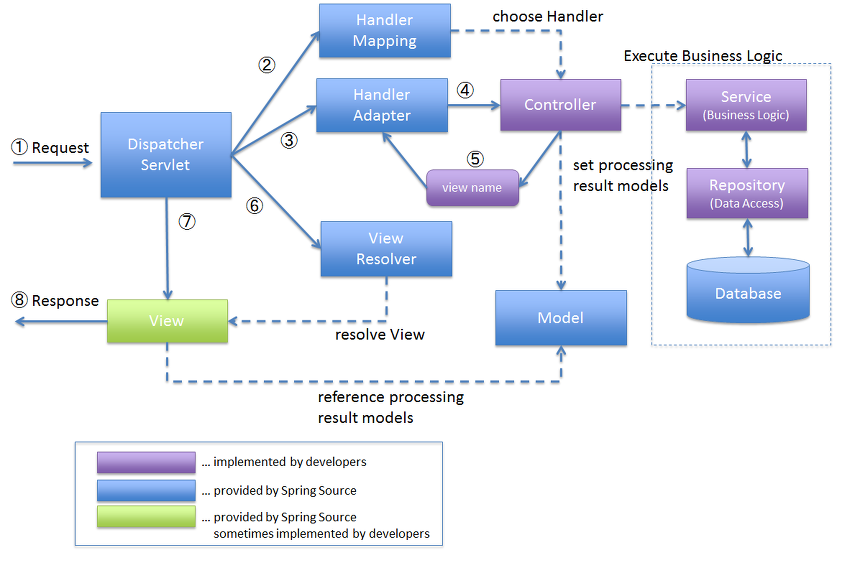

# Spring MVC

Spring MVC consists of components such as DispatcherServlet, View Resolver, Interceptor, Handler, and View, with DispatcherServlet playing the crucial role of the front controller.

# Spring Operation Process

1. DispatcherServlet receives all requests from web browsers.

2. DispatcherServlet retrieves a Handler object from the HandlerMapping that can process the given request. 

   - When using Spring Boot, it first looks for **@RequestMapping annotation-based Handlers** as priority 0 (RequestMappingHandlerMapping).
     - If priority 0 fails, it looks for a Spring bean name that matches the requested URL as priority 1 (BeanNameUrlHandlerMapping).

3. DispatcherServlet retrieves a HandlerAdapter object that can invoke the retrieved Handler. 

   - When using Spring Boot, it looks for the **Adapter of @RequestMapping annotation-based Handlers** as priority 0 (RequestMappingHandlerAdapter).
     - There are also HttpRequestHandlerAdapter for Handlers implementing HttpRequestHandler, and SimpleControllerHandlerAdapter for Handlers implementing Controller, prioritized as 1 and 2 respectively.

4. If there are interceptors to be applied to the Handler object that handles the Controller, DispatcherServlet calls the preHandle method of all interceptor objects.

5. DispatcherServlet executes the method of the actual Controller through the HandlerAdapter object and obtains a ModelAndView.

6. If there are interceptors to be applied to the Handler object that handles the Controller, DispatcherServlet calls the postHandle method of all interceptor objects.
   DispatcherServlet passes the view name obtained from the ModelAndView in step 5 to the ViewResolver to obtain the View object necessary for the response.

7. DispatcherServlet calls the render method of the View object obtained in step 7, passing the Model of the ModelAndView obtained in step 5 as a parameter to perform page rendering.

8. DispatcherServlet returns the rendered page as a response to the user.
