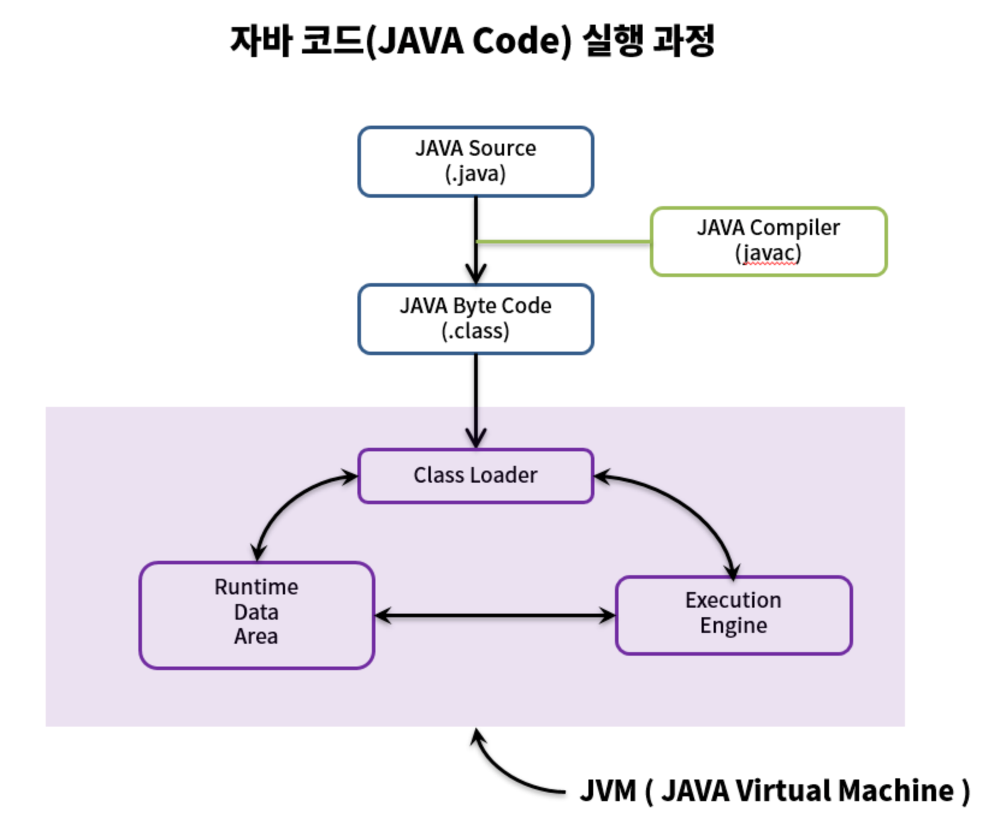

# Java Compilation Process



1. Developers write Java source code (.java files).

2. The Java compiler reads the Java source code (.java files) and compiles them into bytecode (.class files). Bytecode (.class files) are readable by the JVM (Java Virtual Machine) but not directly by computers. (java -> class)

3. The compiled bytecode (.class files) is passed to the JVM's Class Loader.

4. The Class Loader loads necessary classes into the runtime data area (JVM memory) through dynamic loading. The detailed operations of the Class Loader include:

   - **Loading**: Loads class files into JVM memory.
   - **Verification**: Checks if they conform to the Java Language Specification and JVM specifications.
   - **Preparation**: Allocates memory for class variables (fields, methods, interfaces, etc.).
   - **Resolution**: Changes all symbolic references in the constant pool of a class to direct references.
   - **Initialization**: Initializes class variables to appropriate values (static fields).

5. The Execution Engine within the JVM fetches bytecode instructions from the JVM memory and executes them. There are two execution modes:

   1. **Interpreter**: Reads bytecode instructions one by one, interprets, and executes them. Each execution is fast, but overall execution speed is slower.
   2. **JIT Compiler (Just-In-Time Compiler)**: Introduced to overcome the drawbacks of the interpreter. It compiles entire bytecode into binary code, executes it directly as binary, and no longer interprets each method separately. Thus, the overall execution speed is faster than the interpreter.

# Builder Pattern

## Reasons for Using Builder Pattern

- Enables object creation without creating unnecessary constructors.
- Allows creating objects irrespective of the order of data.
- Provides explicit and easy-to-understand code.
- Facilitates easier maintenance.

In essence, the Builder Pattern is a technique to make object creation clean and flexible.

It emerged as an alternative to the telescoping constructor pattern and JavaBeans pattern. Let's first look at why the Builder Pattern came into existence.

## Telescoping Constructor Pattern

```java
public class Post {

    private String title;
    private String content;
    private LocalDateTime date;

    // Telescoping constructor pattern
    public Post() {

    }

    public Post(String title) {
        this.title = title;
    }

    public Post(String title, String author) {
        this.title = title;
        this.author = author;
    }

    public Post(String title, String author, LocalDateTime date) {
        this.title = title;
        this.author = author;
        this.date = date;
    }
}
```

**Disadvantages**

- Difficulty in code maintenance when there are many constructors calling each other.
- Decreased code readability (hard to interpret the meaning solely from constructors with many parameters).

## JavaBeans Pattern

```java
public class Post {

    private String title;
    private String content;
    private LocalDateTime date;

    // JavaBeans pattern
     public String getTitle() {
        return this.title;
    }

    public void setTitle(String title) {
        this.title = title;
    }

    public String getAuthor() {
        return this.author;
    }

    public void setAuthor(String author) {
        this.author = author;
    }

    public LocalDateTime getDate() {
        return this.publishedAt;
    }

    public void setDate(LocalDateTime publishedAt) {
        this.publishedAt = publishedAt;
    }

}
```

```java
@SpringBootTest
public class BuilderPatternTest {
  @Test
  public void Test() {
    Post post = new Post();
    post.setTitle("홍길동전");
    post.setAuthor("허균");
    post.setPublishedAt(LocalDateTime.now());
    post.setPageCount(0);
  }
}
```

**Disadvantages**

- Object consistency is compromised: Object creation isn't completed in one go (need to continue setting values after initial creation).
- Can't create immutable classes easily: Ensuring thread safety requires more work compared to the telescoping pattern.

The Builder pattern emerged as an alternative to these patterns.

## Builder Pattern

```java
public Book(BookBuilder bookBuilder) {
        title = bookBuilder.title;
        author = bookBuilder.author;
        publishedAt = bookBuilder.publishedAt;
        pageCount = bookBuilder.pageCount;
    }

    public static class BookBuilder {
        // Required parameters
        private String title;

        // Optional parameters
        private String author = "";
        private LocalDateTime publishedAt = LocalDateTime.now();
        private int pageCount = 0;

        public BookBuilder (String title) {
            this.title = title;
        }

        public BookBuilder author(String value) {
            author = value;
            return this;    // Return 'this' to chain method calls with dot notation.
        }

        public BookBuilder publishedAt(LocalDateTime value) {
            publishedAt = value;
            return this;
        }

        public BookBuilder pageCount(int value) {
            pageCount = value;
            return this;
        }

        public Book build() {
            return new Book(this);
        }
    }
```

```java
@SpringBootTest
public class BuilderPatternTest {
  @Test
  public void Test() {
    Book book = new Book.BookBuilder("홍길동전")
                        .author("허균")
                        .build();

  }
}
```

Using the Builder pattern is straightforward and provides better readability and flexibility in object creation.

Moreover, lombok's `@Builder` annotation simplifies implementation:

```java
@Builder
public class User {
    private String title;
    private String author = "";
    private LocalDateTime date = LocalDateTime.now();
    private int pageCount = 0;
}
```

```java
User user = User.builder()
		    .title("title")
        	.author("author")
        	.build();
```
