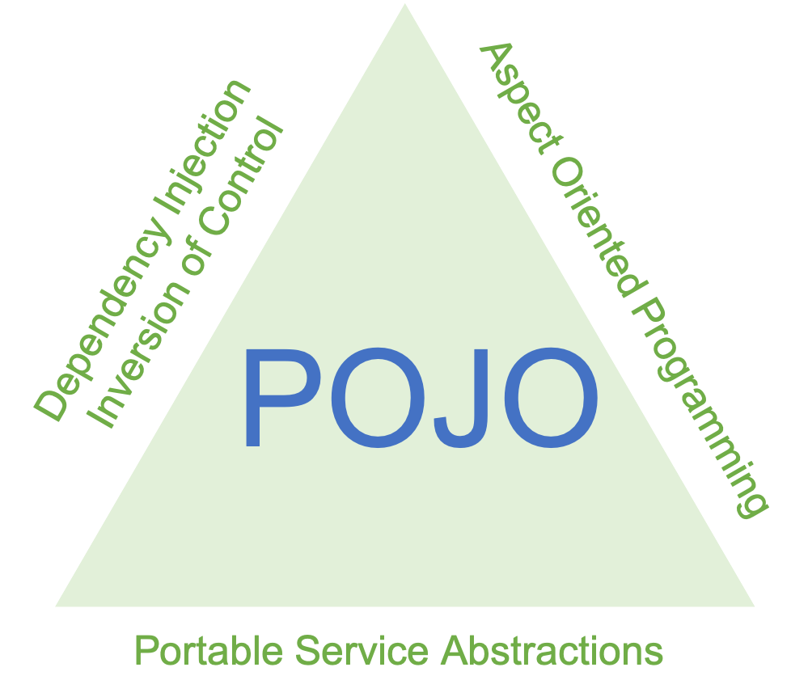

Here's the translated version of your document titled "Spring Boot Summary #1 - 4 Key Features of Spring":

---

title: 'Spring Boot Summary #1 - 4 Key Features of Spring'
date: 2023-04-14 16:04:89
category: SpringBoot
thumbnail: { thumbnailSrc }
draft: false

---



# 1. POJO Programming Emphasis (Plain Old Java Object)

## Meaning of POJO

> Plain Old Java Object, simply POJO, is a term that emerged as a backlash against heavyweight objects tied to frameworks like Java EE. It refers to a simple Java object that is not bound to any specific framework and can be reused across different Java programs.

In other words, POJO refers to an object that adheres strictly to object-oriented principles, is not tied to any particular environment or technology, and can be reused as needed.

```java
public class EmployeePojo {

    public String firstName;
    public String lastName;
    private LocalDate startDate;

    public EmployeePojo(String firstName, String lastName, LocalDate startDate) {
        this.firstName = firstName;
        this.lastName = lastName;
        this.startDate = startDate;
    }

    public String name() {
        return this.firstName + " " + this.lastName;
    }

    public LocalDate getStart() {
        return this.startDate;
    }
}
```

The above example is a POJO because it can be used in any Java program without dependency on any specific framework.

# 2. IoC / DI (Inversion of Control & Dependency Injection)

## DI (Dependency Injection)

DI refers to injecting objects into a class rather than the class creating the objects itself. This approach reduces coupling between modules and increases flexibility.


In the first scenario, class A creates objects B and C directly. In the second scenario, objects B and C are created externally (by an IoC container) and injected into A.

The problem with the first approach arises when changes are made to B, requiring modifications to A as well. It also complicates debugging because errors in B are harder to trace from A.

```java
public class A {
    private B b;

    public A () {
        this.b = new B();
    }
}
```

Contrasted with using DI:

```java
public class A {
    private B b;

    public A(B b) {
        this.b = b
    }
}
```

Or using setter injection:

```java
public class A {
    private B b;

    public setB(B b) {
        this.b= b
    }
}
```

This flexibility is made possible by Spring's IoC container, which manages beans (objects) and their dependencies.

## IoC (Inversion of Control)

IoC refers to the principle where control of object creation and lifecycle is inverted to an external container (like Spring IoC container), which manages dependencies and object instantiation.

# 3. AOP (Aspect Oriented Programming)

AOP, short for Aspect Oriented Programming, is a programming paradigm that modularizes crosscutting concerns (such as logging, security, transaction management) into aspects, reducing code duplication.


In the image above, if classes A, B, C have common concerns X, Y, Z, these concerns are modularized into an aspect block called an Aspect.

Let's see how this is implemented:

build.gradle

```groovy
implementation 'org.springframework.boot:spring-boot-starter-aop'
```

To use Spring AOP, add the above dependency.

```java
@Component
@Aspect
public class PerfAspect {

}
```

Since Spring AOP operates on beans, annotate your class with `@Component` to register it as a Spring bean and `@Aspect` to specify it as an aspect.

Let's look at an example of using AOP for logging across multiple classes.

LogGetData.java

```java
import java.lang.annotation.ElementType;
import java.lang.annotation.Retention;
import java.lang.annotation.RetentionPolicy;
import java.lang.annotation.Target;

@Target(ElementType.METHOD)
@Retention(RetentionPolicy.RUNTIME) // Use annotation at runtime
public @interface LogGetDate {

}
```

The above code defines `@LogGetData` annotation.

LogAspect.java

```java
import org.aspectj.lang.ProceedingJoinPoint;
import org.aspectj.lang.annotation.Around;
import org.aspectj.lang.annotation.Aspect;
import org.aspectj.lang.annotation.Pointcut;
import org.slf4j.Logger;
import org.slf4j.LoggerFactory;
import org.springframework.stereotype.Component;
import java.util.Date;

@Component
@Aspect
public class LogAspect {

	Logger logger = LoggerFactory.getLogger(LogAspect.class); // log

	@Around("@annotation(LogGetDate)") // Run the whole method
	public Object logGetDate(ProceedingJoinPoint joinPoint) throws Throwable {
		Date date = new Date();
		date.getTime(); // Current time the method runs

		Object ret = joinPoint.proceed();

		logger.info(date.toString());

		return ret;
	}
}
```

The above code creates `LogAspect` as an aspect and executes `logGetDate` before methods annotated with `@LogGetDate` are executed.

```java
@GetMapping("/owners/find")
@LogGetDate
public String initFindForm(Map<String, Object> model) {
    model.put("owner", new Owner());
    return "owners/findOwners";
}
```

In the above code, `initFindForm` will execute `logGetDate` before being called due to the `@LogGetDate` annotation.

# 4. PSA (Portable Service Abstraction)

PSA bundles multiple services under a single abstraction. For example, Spring provides various annotations that define roles of classes and enable developers to achieve specific functionalities without writing code directly.

```java
@RestController
@RequiredArgsConstructor
public class PostController {
    private final PostService postService;


    @GetMapping("/post/{postId}")
    public Post getPost(@PathVariable final Long postId) {

        return postService.getDetail(postId);
    }
```

In the above code, `@Controller`, `@GetMapping`, `@PostMapping` are used to map requests to service logic. This is made possible by Spring's hidden functionalities behind annotations, which is the essence of Portable Service Abstraction (PSA).

This is just one example; Spring's features like `@Transactional` ensure all operations succeed or fail together, demonstrating the power of PSA in Spring.
