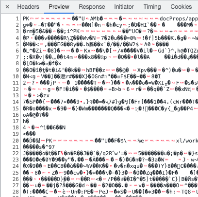

먼저 백엔드 api는 header와 response는 다음과 같다.

header

```json
"content-type": "application/vnd.openxmlformats-officedocument.spreadsheetml.sheet"
"content-disposition": "attachment; filename=파일이름.xlsx"
```

response


### 1. api 호출

header를 blob으로 받기 위해서 axios header에 responseType을 추가해줘야한다.

```javascript
const { data, headers } = await api.excelClient.get(url, {
  responseType: 'blob',
})
```

data를 console에 찍어보면 다음과 같은 blob객체가 출력이 된다.


### 2. blob 객체 생성

그리고 받은 response data로 blob객체를 생성해줘야하는데 이때 type은 header에 있는 content-type을 사용할 수 있다. 참고로 client에서 접근 가능한 header default값은 다음과 같다.

- Cache-Control
- Content-Language
- Content-Type
- Expires
- Last-Modified
- Pragma

이외의 header에 접근하기 위해서는 서버에서 `Access-Control-Expose-Headers` 에 추가해줘야 access가 가능해진다.

```javascript
const { data, headers } = await api.excelClient.get(url, {
  responseType: 'blob',
})
const blob = new Blob([data], {
  type: headers['content-type'],
})
```

### 3. `<a>` 태그를 이용하여 다운로드

다음에는 [createObjectURL](https://developer.mozilla.org/ko/docs/Web/API/URL/createObjectURL)을 사용하여 생성한 blob객체를 가리킬 URL을 생성하고 `<a>` 태그의 href 속성으로 지정한다.

a 태그의 [download](https://www.w3schools.com/tags/att_a_download.asp) 속성을 사용하여 저장할 파일 이름도 설정할 수 있다.

이후에는 [revokeObjectURL](https://developer.mozilla.org/ko/docs/Web/API/URL/revokeObjectURL)을 이용하여 객체 URL을 해제시켜준다.

```javascript
const { data, headers } = await api.excelClient.get(`/api/excel-download`, {
  responseType: 'blob',
})
const blob = new Blob([data], {
  type: headers['content-type'],
})
const blobUrl = URL.createObjectURL(blob)
const link = document.createElement('a')
link.href = blobUrl
link.download = `파일이름` // 확장자는 굳이 추가하지 않아도 .xlsx로 다운로드됨
link.click()
URL.revokeObjectURL(blobUrl)
```

### +) header의 content-disposition를 이용한 파일이름 지정

아까 언급한 client에서 access 가능한 default header에는 포함이 되어있지 않지만 만약 서버의 `Access-Control-Expose-Headers`에 `content-disposition`이 추가되어있다면 백엔드에서 지정한 파일이름으로 저장이 가능하다.

```json
"content-disposition": "attachment; filename=파일이름.xlsx"
```

```javascript
const { data, headers } = await api.excelClient.get(`/api/excel-download`, {
  responseType: 'blob',
})
const blob = new Blob([data], {
  type: headers['content-type'],
})
const blobUrl = URL.createObjectURL(blob)
const link = document.createElement('a')
link.href = blobUrl
// file name 불러오기
const filename = response.headers['content-disposition']
  .split('filename=')[1]
  .split('.')[0]
link.download = filename // 확장자는 굳이 추가하지 않아도 .xlsx로 다운로드됨
link.click()
URL.revokeObjectURL(blobUrl)
```
