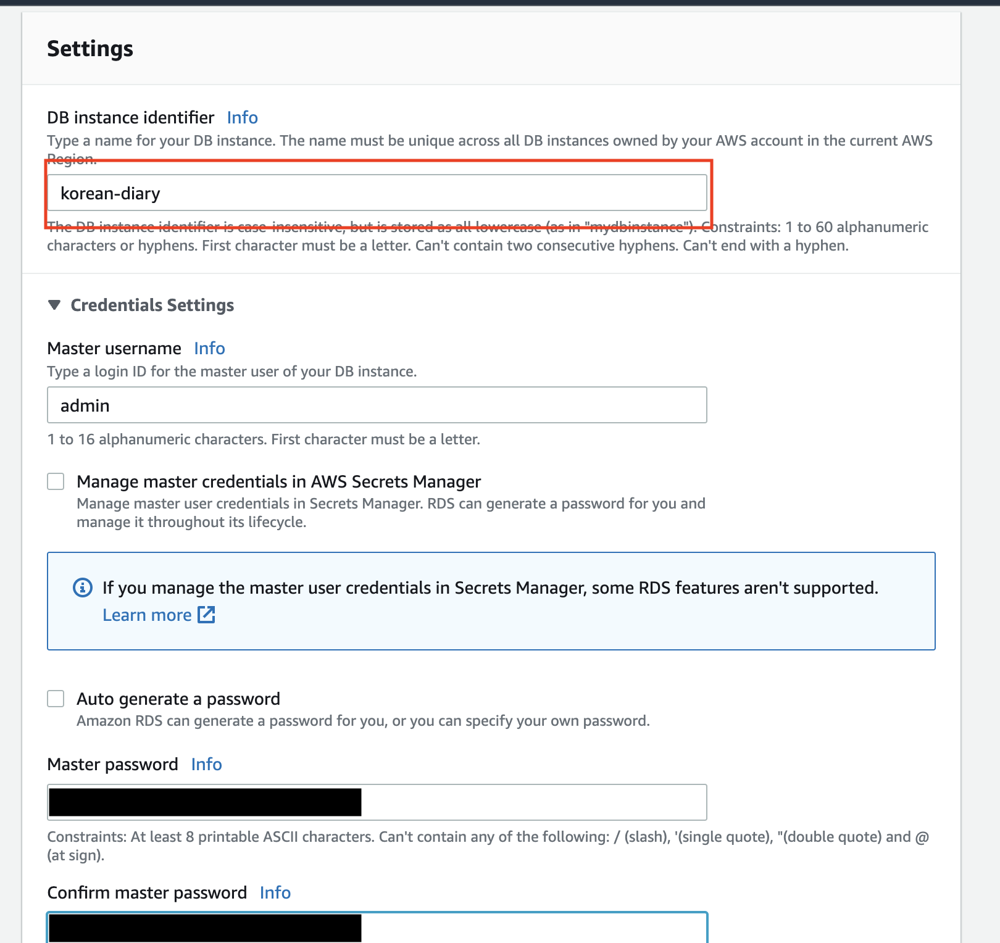
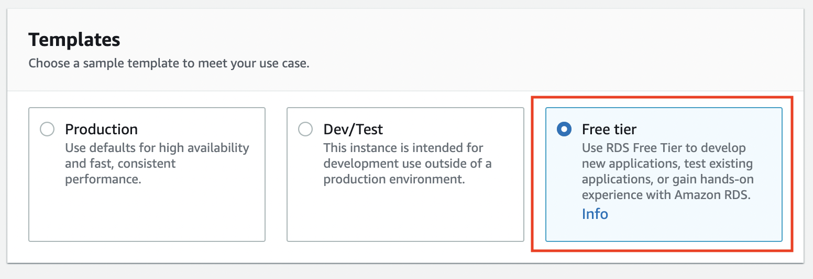
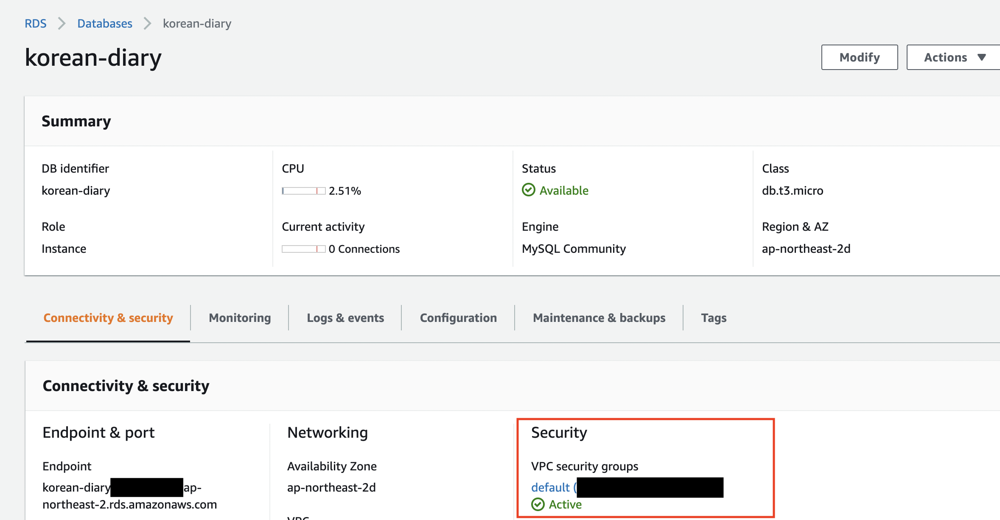
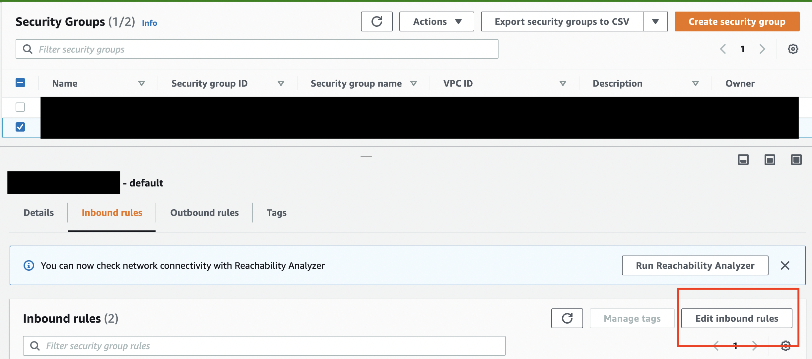
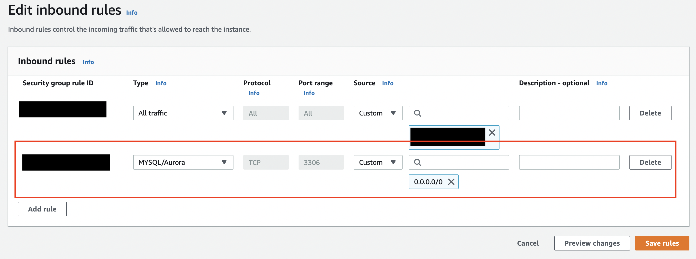
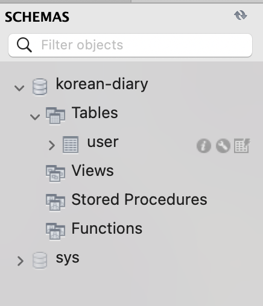

1. RDS 생성

   먼저 AWS console에서 rds를 검색하여 들어갑니다.

   

   create database를 누르고 세팅을 시작해보겠습니다.

   

   사진에서는 MySQL로 선택했는데 본인이 원하는 데이터베이스를 선택해줍니다.

   

   DB instance identifier에 데이터 베이스의 이름을 적어주고, master password 또한 자신이 원하는 비밀번호를 설정해줍니다.
   (MySQL workbench에서 확인하기 위해서 5자리 이상의 비밀번호로 설정하도록 합니다.)

   

   Public access는 활성화 합니다. 그리고 security group 설정이 나오는데 이 부분은 데이터배이스 생성이 끝난 후 추가로 더 설정해줄 계획이기 때문에 지금은 일단 default로 설정하고 넘어가도록 하겠습니다.

   

   지금은 테스트를 목적으로 하는 것이기 때문에 Template은 Free tier로 설정해주도록 합시다.

   

   모든 설정이 끝났다면 다음과 같이 RDS db가 생성된 것을 확인 할 수 있습니다. DB 이름을 클릭하고 상세 내용을 확인해보도록 하겠습니다.

   

   여기서 아까 default로 설정하고 넘어갔던 Security 상세 설정을 해보도록 하겠습니다. 다음 빨간 박스로 표시된 부분에 id를 눌러주면 security group으로 이동합니다.

   

   여기서 inbound rules 탭을 선택해주고 Edit inbound rules를 선택합니다.

   

   여기서 Add rule을 클릭하여 다음 사진과 같이 설정해 줍니다. MySQL을 위한 3306 포트를 열어주는 것입니다.

   

2. MySQL Workbench에서 확인

   다음은 MySQL Workbench에서 DB연결이 잘되는지 확인해보겠습니다. 아까 생성한 DB의 Endpoint를 가져오고 Username은 admin 그리고 설정했던 password를 입력합니다.

   

   잘 세팅이 됐다면 다음과 같이 잘 연결되는 것을 확인할 수 있을 것 입니다!

   

   이제 프로젝트에 사용할 데이터베이스를 추가해보겠습니다. 원하는 대로 schema의 이름과 인코딩 정보를 설정하고 생성해줍니다.

   

3. Spring boot 프로젝트와 연결

   마지막 단계로 Spring boot 프로젝트에 코드를 추가해보겠습니다.

   테스트 용으로 간단한 User table을 추가해주도록 하겠습니다. (이미 model이 설계되어 있다면 이 단계는 넘어가도 좋습니다.)

   ```java
   package com.finalproject.kdiary.domain.model;

   import lombok.NoArgsConstructor;

   import javax.persistence.\*;
   import java.util.UUID;

   @NoArgsConstructor
   @Entity
   @Table(name="user")
   public class User {
   @Id
   private String id=UUID.randomUUID().toString();
   @Column(length = 50)
   private String name;
   }
   ```

   다음은 build.gradle에 dependency를 추가해주도록 합니다.

   ```groovy
   dependencies {
      implementation 'org.springframework.boot:spring-boot-starter-data-jpa'
      implementation 'mysql:mysql-connector-java:8.0.32'
   }
   ```

   마지막으로 application.properties에 다음 내용을 추가합니다. 이 파일에는 AWS 정보가 들어가기 때문에 gitignore에 application.properties 파일을 넣도록 합시다.

   ```properties
   spring.datasource.url=jdbc:mysql://{{endpoint}}:3306/{{DB_name}}?useSSL=false&useUnicode=true&allowPublicKeyRetrieval=true&serverTimezone=Asia/Seoul
   spring.datasource.username=admin
   spring.datasource.password={{password}}
   spring.datasource.driver-class-name=com.mysql.cj.jdbc.Driver
   spring.jpa.show-sql=true
   spring.jpa.hibernate.ddl-auto=update
   spring.jpa.properties.hibernate.format_sql=true
   ```

   자 이제 프로젝트를 실행시켜보면 다음과 같이 create table이 되는 로그가 찍힙니다.

   

   그리고 MySQL workbench에서 확인해보면 User table이 생성된 걸 확인할 수 있습니다.

   
