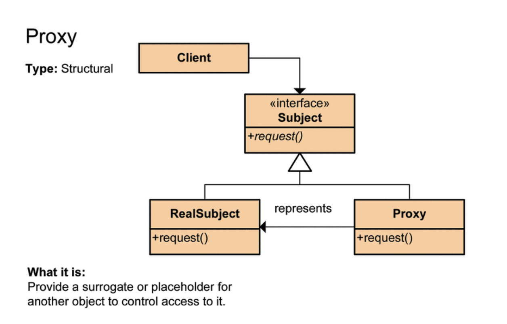

# ORM의 장단점

## ORM

- Object-relational mapping (객체 관계 매핑)
- 객체는 객체대로 설계
- 관계형 데이터베이스는 관계형 데이터베이스대로 설계
- ORM 프레임워크가 중간에서 매핑
- 우리가 일반적으로 알고 있는 애플리케이션 class와 RDB의 테이블을 매핑(연결)한다는 뜻이며, 기술적으로 어플리케이션의 객체를 RDB테이블에 자동으로 영속화 해주는 것이라고 보면 된다.

## 장점

- SQL문이 아닌 Method를 통해 DB를 조작할 수 있어, 개발자는 객체 모델을 이용하여 비즈니스 로직을 구성하는 데만 집중할 수 있다.
  (내부적으로는 쿼리를 생성하여 DB를 조작하는데, 하지만 개발자가 이를 신경쓰지 않아도 된다.)
- Query와 같이 필요한 선언문, 할당 등의 부수적인 코드가 줄어들어, 각종 객체에 대한 코드를 별도로 작성하여 코드의 가독성을 높인다.
- 객체지향적인 코드 작성이 가능하며 오직 객체지향적 접근만 고려하면 되기 때문에 생산성이 증가한다.
- 매핑하는 정보가 Class로 명시 되었기 때문에 ERD를 보는 의존도를 낮출 수 있고 유지보수 및 리팩토링에 유리하다.

## 단점

- 학습비용이 비싸다.
- 프로젝트의 규모가 크고 복잡하여 설계가 잘못된 경우, 속도 저하 및 일관성을 무너뜨리는 문제점이 생길 수 있다.
- 복잡하고 비즈니스 로직에 종속적인 쿼리는 속도를 위해 별도의 튜닝이 필요하기 때문에 결국 SQL문을 써야할 수도 있다.

# @DynamicUpdate

Repository에서 `save()` 메소드를 실행시키면 JPA의 기본 동작은 변경되지 않은 컬럼도 update 쿼리에 포함한다.
`@DynamicUpdate`은 실제 값이 변경된 컬럼으로만 update 쿼리를 만드는 기능이다.

```java
@Entity
@DynamicUpdate
@TypeDef(name = "order_status", typeClass = PostgreSQLEnumType.class)
public class PizzaOrder {
    @Id
    private Integer id;

    @Enumerated(EnumType.STRING)
    @Column(columnDefinition = "post_status_info")
    @Type(type = "order_status")
    private OrderStatus status;

    @CreationTimestamp
    private Timestamp orderTime;

    public enum OrderStatus {
        Ordered,
        Baking,
        Delivering,
        YummyInMyTummy
    }
}
```

위의 예시에서 피자를 주문하는 경우 피자 주인이 주문을 접수하면 order status가 Ordered에서 Banking으로 바뀌어야한다.
`repository.save(pizzaOrder)`를 실행시키면 Hibernate는 다음과 같은 SQL문을 생성한다.

```SQL
Hibernate:
    update
        pizza_order
    set
        order_time=?,
        status=?
    where
        id=?
```

변하지 않은 `order_time`까지 UPDATE문에 포함된 것을 볼 수 있다.

`@DynamicUpate` 어노테이션을 다음과 같이 추가해보자.

```java
@Entity
@DynamicUpdate
@TypeDef(name = "order_status", typeClass = PostgreSQLEnumType.class)
public class PizzaOrder {
    // The rest of the implementation
}
```

`repository.save(pizzaOrder)`를 실행시키면 Hibernate는 다음과 같이 order_time의 update를 포함하지 않는 SQL문을 생성한다.

```sql
Hibernate:
    update
        pizza_order
    set
        status=?
    where
        id=?
```

# 정규표현식

> 정규표현식(Regular Expression)이란 컴퓨터 과학의 정규언어로부터 유래한 것으로 특정한 규칙을 가진 문자열의 집합을 표현하기 위해 쓰이는 형식언어

개발을 하다보면 전화번호, 주민등록번호, 이메일등과 같이 정해져있는 형식이 있고 사용자가 그 형식대로 제대로 입력했는지 검증을 해야하는 경우가 종종 있다. 이런 입력값을 정해진 형식에 맞는지 검증해야 할 때에는 정규표현식을 사용하면 쉽게 구현할 수 있다.

## 정규표현식 작성 방법

정규 표현식을 작성하는 방법은 자바 API java.util.regex 패키지를 사용해야 한다. 자바에서 정규표현식을 사용할때에는 java.util.regex 패키지 안에 있는 Pattern클래스와 Matcher클래스를 주로 사용한다.

### Pattern 클래스

정규 표현식에 대상 문자열을 검증하는 기능은 java.util.regex.Pattern 클래스의 matches()메소드를 활용하여 검증할 수 있다. matches() 메서드의 첫번째 매개값은 정규표현식이고 두번째 매개값은 검증 대상 문자열이다. 검증 후 대상문자열이 정규표현식과 일치하면 true, 그렇지 않다면 false값을 리턴한다.

```java
import java.util.regex.Pattern;

public class RegexExample {
	public static void main(String[] args)  {

            String pattern = "^[0-9]*$"; //숫자만
            String val = "123456789"; //대상문자열

            boolean regex = Pattern.matches(pattern, val);
            System.out.println(regex);
    }
}
```

### Matcher 클래스

Matcher 클래스는 대상 문자열의 패턴을 해석하고 주어진 패턴과 일치하는지 판별할 때 주로 사용된다. Matcher 클래스의 입력값으로는 CharSequence라는 새로운 인터페이스가 사용되는데 이를 통해 다양한 형태의 입력 데이터로부터 문자 단위의 매칭 기능을 지원 받을 수 있다. Matcher객체는 Pattern객체의 matcher() 메소드를 호출하여 받아올 수 있다.

```java
import java.util.regex.Matcher;
import java.util.regex.Pattern;

public class RegexExample {
public static void main(String[] args) {
Pattern pattern = Pattern.compile("^[a-zA-Z]\*\$"); //영문자만
String val = "abcdef"; //대상문자열
Matcher matcher = pattern.matcher(val);
System.out.println(matcher.find());
}
}
```

## 유효성 검사 예시

```java
import java.util.regex.Pattern;

public class RegexExample {
	public static void main(String[] args)  {
          String name = "홍길동";
          String tel = "010-1234-5678";
          String email = "test@naver.com";

          //유효성 검사
          boolean name_check = Pattern.matches("^[가-힣]*$", name);
          boolean tel_check = Pattern.matches("^01(?:0|1|[6-9])-(?:\\d{3}|\\d{4})-\\d{4}$", tel);
          boolean email_check = Pattern.matches("\\w+@\\w+\\.\\w+(\\.\\w+)?", email);

          //출력
          System.out.println("이름 : " + name_check);
          System.out.println("전화번호 : " + tel_check);
          System.out.println("이메일 : " + email_check);
    }
}
```

## Regex 관련 사이트

아래와 같은 사이트를 사용하면 정규식 생성과 검사를 쉽게 할 수 있다.
https://regexr.com

# 프록시

> 프록시란 '대리'라는 의미로 프록시에게 어떤 일을 대신 시키는것이다.
> 예를 들어 보안분야에서, 보안상의 이유로 서버를 외부에 노출시키지 않기 위해 서버와 클라이언트단 중간에서 접점을 담당하는 서버를 보고 프록시서버라고 부른다.

## 프록시 패턴이란?

디자인패턴중 하나로, 다른 무언가와 이어지는 인터페이스 역할을 하는 클래스를 의미한다.
인터페이스를 사용하고 실행시킬 클래스에 대해 객체가 들어갈 자리에 대리자 객체를 대신 투입하여,
클라이언트는 실제 실행시킬 클래스에 대한 메소드를 호출하여 반환값을 받는지
대리 객체의 메소드를 호출해서 반환값을 받는지 모르게 하는것을 말한다.



위 그림에서 보듯, 클라이언트가 Subject인터페이스의 request()를 호출하면 구현클래스인 RealSubject의 request()가 호출된다.
이때 프록시가 대신 RealSubject의 request()메서드를 호출하고 그 반환값을 클라이언트에게 전달하는것이다.

위 그림을 코드로 구현해보자.

```java
public interface Subject {
    String request();
}
```

```java
public class RealSubject implements Subject {

    @Override
    public String request() {
        return "HelloWorld";
    }
}
```

```java
public class Proxy implements Subject {

    private final RealSubject realSubject = new RealSubject();

    @Override
    public String request() {
        return realSubject.request();  //프록시가 실제의 메소드를 호출한다.
    }

}
```

```java
public class Main {

    public static void main(String[] args) {
        // Subject클래스의 메소드를 호출하는것이아닌 프록시클래스의 메소드를 호출한다.
        Subject subject = new Proxy();
        System.out.println(subject.request()); // 내부적으로 Subject의 메소드를 호출한다.

    }
}
```

이렇게 코드를 작성할경우

1. 인터페이스를 두기때문에 개발코드에서 구현체에 영향을 받지 않는다.
2. 구현클래스에 직접 접근하지않고 Proxy를 통해 한번 우회하여 접근하도록 되어있다. ( 흐름제어 )

## 프록시 패턴은 왜 사용하는가

흐름을 제어할수 있다. 그렇다면 흐름제어는 왜 필요한가??

프록시 객체를 사용하지않는 아래 사진과같은 상황을 생각해보자.

많은 양의 리소스를 필요로하는 상황에서 디비쿼리가 엄청나게 느려질 수 있다.
이럴때 지연초기화를 위한 코드작성을 해야하는데 이를 모든 클래스마다 직접 넣어버리면 엄청나게 많은 코드중복이 발생할것이다.

따라서 아래사진과같이 프록시객체를 이용하면 요청을 프록시객체가 먼저 받은뒤에 흐름을 제어하여 디비에 쿼리를 날릴 수 있게된다.


1. 실제 메소드가 호출되기 이전에 필요한 기능(전처리등의)을 구현객체 변경없이 추가할 수 있다.(코드변경의 최소화)
2. 캐시를 사용할 수 있다.
   프록시가 내부캐시를 통해 데이터가 캐시에 존재하지 않는 경우에만 주체클래스에서 작업이 실행되도록 할 수 있다.
