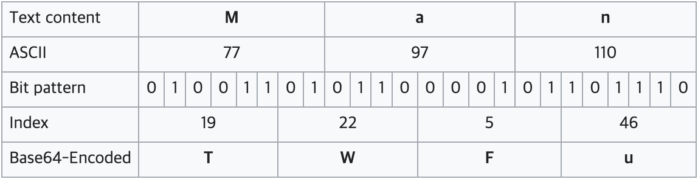

# Front Auth 로직

지금까지 프론트엔드 개발에서 로그인 로직을 구현할 때 다음과 같은 로직을 가장 많이 사용했습니다.

1. Login API의 response로 Access Token과 Refresh Token을 받는다.
2. Access Token과 Refresh 토큰을 local storage나 cookie에 저장한다.
3. Access Token은 API 호출 시 HTTP Request header의 Authorization 필드에 `Bearer + <Access Token>`형식으로 넣는다

여기서 Access Token과 Refresh Token으로 JWT 토큰을 주로 사용하는데 이 JWT 토큰의 구조를 살펴보도록 하겠습니다.

# JWT 토큰 생성 원리

JWT 토큰은 `.`을 기준으로 Header, Payload, Signature 세 부분으로 나뉩니다.
그리고 각각의 부분은 Base64URL로 인코딩 되어 표현됩니다.


## Base64url encoding

Base64url 인코딩이란 각각의 Base64 문자 하나는 6비트를 나타내는데, 64개의 문자를 0부터 63까지의 숫자로 변환하여 전체 데이터를 하나의 string 으로 바꾸는 인코딩 방식을 말합니다.
[base64](https://ko.wikipedia.org/wiki/%EB%B2%A0%EC%9D%B4%EC%8A%A464)

예시로 **Man**이라는 단어를 인코딩하는 과정은 다음과 같습니다.



아래 예시는 객체를 base64Url 방식으로 인코딩 한 결과입니다. JWT 토큰을 받으면 거의 항상 ey로 시작하는 문자열을 받았는데 이 예시를 확인해보면서 객체를 인코딩한다면 `{` 문자가 항상 제일 첫문자로 포함되기 때문에 모든 토큰은 ey로 시작되는게 아닐까하는 생각이 들었습니다🧐

```
{ 'name': 'Anna' }
```

```
eyAnbmFtZSc6ICdBbm5hJyB9
```

# JWT 토큰의 구조

위에서 JWT 토큰은 Header, Payload, Signature로 구분된다고 했는데, 각 부분의 의미에 대해 살펴보도록 하겠습니다.

## 1. Header

```
{
  "alg": "HS256",
  "typ": "JWT"
}
```

Header에서는 해당 토큰의 type(`typ`)과 HMAC-SHA256 또는 RSA와 같은 signing 알고리즘(`alg`)을 명시합니다.
여기서 지정한 알고리즘은 세번째 부분인 Signature를 생성할 때 사용됩니다.

## 2. Payload

```
{
  "sub": "1234567890",
  "name": "John Doe",
  "iat": 1516239022
}
```

payload 또한 객체의 형식을 가지는데 객체 안의 한쌍의 name-value를 claim이라고 합니다.
이 claim은 세 종류(registered claims, public claims, private claims)로 나뉘게 됩니다.

- Registered Claims

  Registered Claim은 등록된 claim이라는 뜻으로 예약어와 같이 이미 정의되어있는 claim들을 뜻합니다.
  이 claim들을 사용하는 것은 optional(사용해도 되고, 안해도 된다는 뜻)입니다.

  Registered Claim에는 다음과 같은 것들이 있습니다.

  ```
  {
    "iss": <issuer: 토큰 발급자>,
    "exp": <expiration time: 토큰 만료시간>,
    "sub": <subject: 토큰 제목>,
    "aud": <audience: 토큰 대상자>,
  }
  ```

  [기타 registered claims](https://datatracker.ietf.org/doc/html/rfc7519#section-4.1)

* Public Claims

  Public Claims는 공개된 Claim으로 jwt 토큰을 사용하는 사람들에 의해 정의될 수 있습니다.
  이 Claim의 이름은 충돌을 피하기 위해서 [IANA JSON Web Token Registry](https://www.iana.org/assignments/jwt/jwt.xhtml)에 정의되거나 uri 형식으로 짓게 됩니다.

  ex) public claim의 예시

  ```
  {
      "name": "Anna An", // IANA JSON Web Token Registry에 정의되어 있는 Claim
      "https://chaerin.dev/jwt_claims/is_admin": true
  }

  ```

* Private Claims
  Private Claims이란 Registered도 아니고 Public도 아닌, 구성원들 간 합의하여 결정한 claim을 의미합니다.
  주로 서버 <-> 클라이언트 간에 합의된 claim의 이름을 뜻합니다.
  ```
  {
      "username": "chaerin00"
  }
  ```

## 3. Signature

Header와 Payload는 Base64를 사용하여 인코딩 되고 누구나 decode하여 내용을 볼 수 있습니다.
그렇기 때문에 토큰을 내용을 다른 사람이 함부로 위조할 수 없도록 토큰의 위조 여부를 검증하기 위해 바로 이 Signature이 존재하는 것입니다.
Signature를 만들기 위해서는 인코딩된 Header, 인코딩된 Payload, secret key, 헤더에 명시된 signing 알고리즘을 사용합니다.

```
HMACSHA256(
  base64UrlEncode(header) + "." +
  base64UrlEncode(payload),
  secret)
```

위의 예시는 헤더에서 지정한 `HS256` 즉 HMAC SHA256 알고리즘을 이용하여 시그니처를 생성하는 pseudo code 예시입니다.

위에 언급한 Header, Payload, Signature를 모두 `.`으로 연결하면 JWT 토큰이 완성됩니다.

<hr/>

JWT 토큰에 대해 알아보면서 평소 사용하던 Auth 로직의 문제점들을 발견할 수 있었습니다.
토큰의 저장 위치나 Refresh Token의 동작 방식도 스스로 더 공부해봐야할 주제인 것 같습니다.
