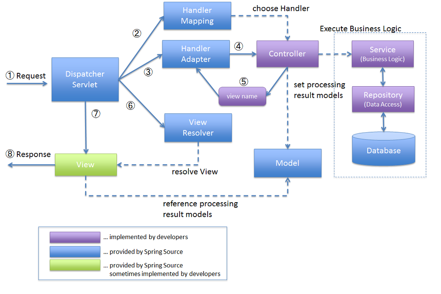

# Spring MVC

Spring MVC는 DispatcherServlet, View Resolver, Interceptor, Handler, View 등으로 구성되어있다.
이중에 DispatcherServlet이 가장 앞단의 front controller역할을 하며 가장 핵심적인 역할을 한다.

# Spring의 동작과정

1. DispatcherServlet이 모든 웹 브라우저로부터의 요청을 받는다.

2. DispatcherServlet은 HandlerMapping으로 부터 주어진 request를 처리할 수 있는 Handler객체를 가져온다. 

   - SpringBoot를 사용하면 0순위로 **@RequestMapping 애노테이션 기반 Handler**를 찾아 반환한다.(RequestMappingHandlerMapping)
     - 0순위가 실패하면 1순위로는 **요청한** **URL과 일치하는 스프링 빈 이름의 Handler**를 찾아 반환한다. (BeanNameUrlHandlerMapping)

3. 가져온 Handler를 실행(invoke) 시킬 수 있는 HandlerAdapter객체를 가져온다. 

   - SpringBoot를 사용하면 0순위로 **@RequestMapping 애노테이션 기반 Handler의 Adapter**를 찾아 반환한다. (RequestMappingHandlerAdpater)
     - 1,2 순위로 HttpRequestHandler를 implements하여 구현한 Handler를 처리하는 **HttpRequestHandlerAdapter**와 Controller를 implements하여 구현한 Handler를 처리하는 **SimpleControllerHandlerAdpater** 등이 있다.

4. 만약 해당 Controller를 처리할 Handler객체에 적용할 interceptor가 존재한다면 모든 interceptor객체의 preHandle메소드를 호출한다.

5. HandlerAdapter객체를 통해 실제 컨트롤러의 메소드를 실행 후 ModelAndView를 얻는다.

6. 만약 해당 Controller를 처리할 Handler객체에 적용할 interceptor가 존재한다면 모든 interceptor객체의 postHandle메소드를 호출한다.
   DispatcherServlet은 5번 과정에서 얻은 ModelAndView를 통해 view name을 ViewResolver에게 전달하여 응답에 필요한 View객체를 얻어온다.

7. DispatcherServlet은 7번 과정에서 얻은 View객체에 5번 과정에서 얻은 ModelAndView의 Model을 파라미터로 넘겨주어 render메소드를 호출하여 페이지 렌더링을 수행한다.

8. DispatcherServlet은 렌더링된 페이지를 response로 사용자에게 리턴한다.
