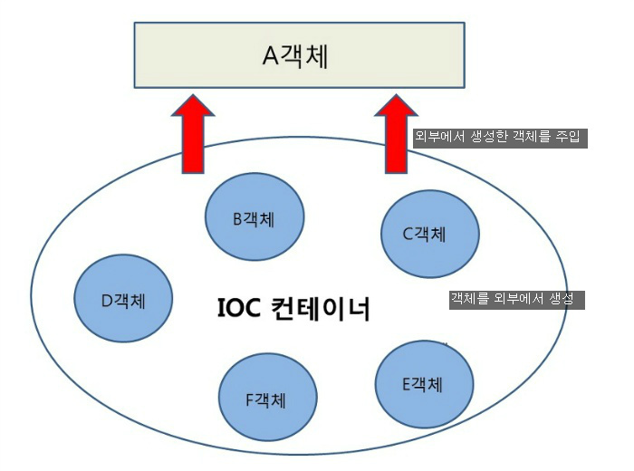
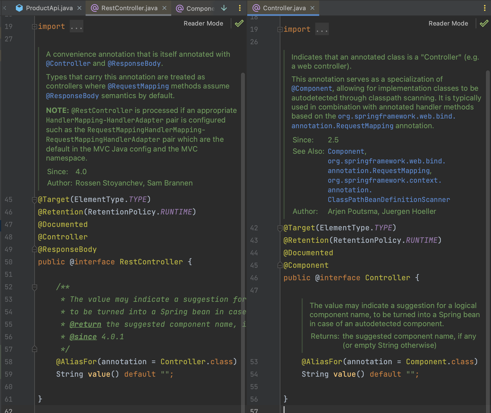

# 1. POJO 프로그래밍 지향 (Plane Old Java Object)

## POJO의 의미

> Plain Old Java Object, 간단히 POJO는 말 그대로 해석을 하면 오래된 방식의 간단한 자바 오브젝트라는 말로서 Java EE 등의 중량 프레임워크들을 사용하게 되면서 해당 프레임워크에 종속된 "무거운" 객체를 만들게 된 것에 반발해서 사용되게 된 용어이다.

다른 말로 정리하자면 POJO란, 객체 지향적인 원리에 충실하면서 환경과 기술에 종속되지 않고 필요에 따라 재사용될 수 있는 오브젝트를 말한다.

```java
public class EmployeePojo {

    public String firstName;
    public String lastName;
    private LocalDate startDate;

    public EmployeePojo(String firstName, String lastName, LocalDate startDate) {
        this.firstName = firstName;
        this.lastName = lastName;
        this.startDate = startDate;
    }

    public String name() {
        return this.firstName + " " + this.lastName;
    }

    public LocalDate getStart() {
        return this.startDate;
    }
}
```

위의 예시는 어떤 프레임워크에도 종속되지 않고 어떤 자바프로그램에서든 사용가능한 클래스이기 때문에 POJO이다.

# 2. IoC / DI (Inversion of Control & Dependency Injection)

## DI(Dependency Injection)

DI는 객체를 직접 생성하지 않고 외부에서 생성한 후 주입시켜주는 방식을 말한다.
이를 이용하면 모듈 간의 결합도가 낮아지고 유연성을 높일 수 있다.


첫번째는 A객체에서 B, C 객체를 생성하는 반면, 두번째는 외부 컨테이너(IoC)에서 B, C 객체를 생성한 후 A에 주입시키는 것을 확인할 수 있다.

첫번째 방법이 문제가 되는 이유는 무엇일까?

```java
public class A {
    private B b;

    public A () {
        this.b = new B();
    }
}
```

다음과 같이 A 클래스에서 B 클래스를 생성한다고 하면 B클래스에서 수정이 생겼을 때 A 클래스까지 수정해야하는 상황이 발생한다.
또한 error가 발생했을 때 A에서 발생한 에러인지 아니면 내부의 B에서 발생한 에러인지 파악하기 어려워 Unit test가 어려워지게 된다.

```java
public class A {
    private B b;

    public A(B b) {
        this.b = b
    }
}
```

위의 예제는 직접 B 객체를 생성하지 않고 외부에서 생성자를 통해 전달 받아 의존성을 주입하는 예시이다.

```java
public class A {
    private B b;

    public setB(B b) {
        this.b= b
    }
}
```

위의 예제는 생성자가 아닌 setter를 이용해 의존성을 주입하는 예시이다.

이것이 어떻게 가능한지 알아보자.



스프링 IoC 컨테이너가 관리하는 객체들을 Bean 이라고 부른다. 스프링은 이러한 Bean들의 의존성을 관리하고, 객체를 만들어 주며, Bean으로 등록을 해 주고, 이렇게 만들어진 것들을 관리한다.
이러한 스프링에서의 의존성 주입은 반드시 Bean으로 등록된 객체들 끼리만 가능하다. 스프링 IoC 컨테이너는 Bean으로 등록되지 않은 객체에는 의존성 주입을 해 주지 않는다.

그런데 여기서 의문이 생긴다. 그동안 생성자 주입이든 setter 주입이든 DI를 사용해왔는데 따로 객체를 Bean으로 등록시킨 적은 없다는 것이다.

주로 의존성 주입은 Controller에 Repository를 연결할 때 사용했다.

```java
@RestController
@RequestMapping(value = "/product")
public class ProductController {
    private final ProductRepository productRep;

    public ProductApi(ProductRepository productRep) {
        this.productRep = productRep;
    }
}
```

어떻게 ProductController가 bean으로 등록되었는지는 RestController를 뜯어보니 알 수 있었다.


@RestController안에는 @Controller가 @Controller안에는 @Component 어노테이션이 있다.
스프링은 @Component가 있는 객체를 bean으로 등록시켜준다.

이렇게 사용하고 있던 annotation을 이용해 객체를 bean으로 등록하고 있었던 것이다.
(찾아보니 IntelliJ Ultimate 버전을 활용하면 bean으로 등록된 객체는 옆에 아이콘으로 표시해준다고 한다.)

## IoC(Inversion of Control)

IoC는 제어권 역전을 의미하며 직접 의존성을 만들지 않고 외부에서 의존성을 가져오는 것을 의미한다.
즉 DI는 IoC의 일종이라고 할 수 있다.

# 3. AOP (Aspect Oriented Programming)

AOP는 **Aspect Oriented Programming**의 약자로 관점 지향 프로그래밍이라고 불린다. 흩어진 Aspect들을 모아서 모듈화하여 코드의 중복을 줄이는 프로그래밍 기법이다.


위의 이미지와 같이 class A, B, C가 있고 각각의 클래스에 중복되는 기능 X, Y, Z(Crosscutting Concerns)들이 있다면 이를 Aspect라는 블럭으로 모듈화 하는 것이다.

코드를 통해 이를 어떻게 구현하는지 알아보자.

build.gradle

```groovy
implementation 'org.springframework.boot:spring-boot-starter-aop'
```

spring AOP를 사용해주려면 다음과 같이 의존성을 추가해줘야한다.

```java
@Component
@Aspect
public class PerfAspect {

}
```

Spring AOP는 Bean에서만 동작하기 때문에 `@Component` Annotation을 사용하여 스프링 Bean으로 등록하여 사용해준다.
`@Aspect` 어노테이션을 붙이면 해당 클래스가 Aspect라는 것을 명시해준다.

로그를 찍는 기능이 여러 클래스에 공통적으로 구현해야 하는 상황에서 AOP를 어떻게 활용할 수 있을지 예제를 통해 알아보자.

LogGetData.java

```java
import java.lang.annotation.ElementType;
import java.lang.annotation.Retention;
import java.lang.annotation.RetentionPolicy;
import java.lang.annotation.Target;

@Target(ElementType.METHOD)
@Retention(RetentionPolicy.RUNTIME) // Annotation을 런타임까지 사용
public @interface LogGetDate {

}
```

위 코드는 @LogGetData라는 annotation을 만들어주기 위한 코드이다.

LogAspect.java

```java
import org.aspectj.lang.ProceedingJoinPoint;
import org.aspectj.lang.annotation.Around;
import org.aspectj.lang.annotation.Aspect;
import org.aspectj.lang.annotation.Pointcut;
import org.slf4j.Logger;
import org.slf4j.LoggerFactory;
import org.springframework.stereotype.Component;
import java.util.Date;

@Component
@Aspect
public class LogAspect {

	Logger logger = LoggerFactory.getLogger(LogAspect.class); // log

	@Around("@annotation(LogGetDate)") // method 실행 되는 전 과정
	public Object logGetDate(ProceedingJoinPoint joinPoint) throws Throwable {
		Date date = new Date();
		date.getTime(); // 메소드가 실행되는 현재 시간

		Object ret = joinPoint.proceed();

		logger.info(date.toString());

		return ret;
	}
}
```

위의 코드는 LogAspect라는 Aspect를 생성하였고 LogGetData라는 어노테이션이 붙은 method가 실행 되기 전 logGetDate라는 메소드가 실행되는 코드이다.

```java
@GetMapping("/owners/find")
@LogGetDate
public String initFindForm(Map<String, Object> model) {
    model.put("owner", new Owner());
    return "owners/findOwners";
}
```

위의 코드에서 보면 다음 getAPI가 호출될 때 @LogGetDate 어노테이션이 붙어있으므로 LogAspect가 불리고 initFindForm이 실행되기 전 logGetDate 메소드가 실행되게 된다.

# 4. PSA (Portable Service Abstraction)

PSA는 하나의 추상화로 여러 서비스들을 묶어둔 것이다.
예를 들어 Spring에는 다양한 annotation들이 있고 이를 활용하면 클래스의 역할을 지정할 뿐 아니라 개발자가 직접 코드를 작성하지 않고도 특정 기능을 수행하게 할 수 있다.

```java
@RestController
@RequiredArgsConstructor
public class PostController {
    private final PostService postService;


    @GetMapping("/post/{postId}")
    public Post getPost(@PathVariable final Long postId) {

        return postService.getDetail(postId);
    }
```

위의 코드를 보면 `@Controller`, `@GetMapping`, `@PostMapping`을 활용하여 요청과 service 로직을 매핑시켜주는 것을 볼 수 있다.
이것이 가능한 이유는 Spring에서 제공해주는 여러 기능이 annotation 뒤에 숨겨져 있기 때문인데 이것이 바로 서비스 추상화 PSA이다.

위의 예시 뿐만 아니라 `@Transactional`을 사용하면 모든 로직이 성공적으로 수행되었다면 DB에 커밋 만약 아니라면 rollback을 해주는 등 이 PSA 개념을 사용한 Spring의 기능들이 많이 있다.
