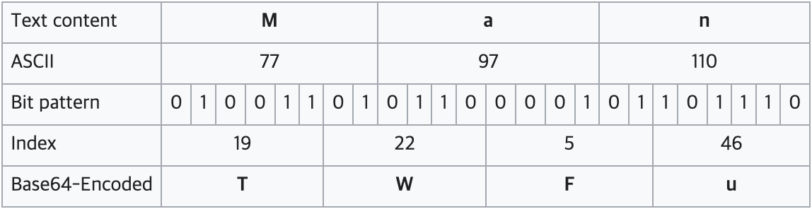

# Front Auth 로직

지금까지 프론트엔드 개발에서 로그인 로직을 구현할 때 다음과 같은 로직을 가장 많이 사용했습니다.

1. Login API의 response로 Access Token과 Refresh Token을 받는다.
2. Access Token과 Refresh 토큰을 local storage나 cookie에 저장한다.
3. Access Token은 API 호출 시 header의 Authorization에 `Bearer + <Access Token>`형식으로 넣는다

여기서 Access Token과 Refresh Token으로 JWT 토큰을 주로 사용하는데 이 JWT 토큰의 구조를 살펴보도록 하겠습니다.

# JWT 토큰 생성 원리

JWT 토큰은 `.`을 기준으로 Header, Payload, Signature 세 부분으로 나뉩니다.
그리고 각각의 부분은 Base64URL로 인코딩 되어 표현됩니다.


## Base64url encoding

Base64url 인코딩이란 각각의 Base64 문자 하나는 6비트를 나타내는데, 64개의 문자를 0부터 63까지의 숫자로 변환하여 전체 데이터를 하나의 string 으로 바꾸는 인코딩 방식을 말합니다.
[base64](https://ko.wikipedia.org/wiki/%EB%B2%A0%EC%9D%B4%EC%8A%A464)

예시로 **Man**이라는 단어를 인코딩하는 과정은 다음과 같습니다.



아래 예시는 객체를 base64Url 방식으로 인코딩 한 결과입니다. JWT 토큰을 받으면 거의 항상 ey로 시작하는 문자열을 받았는데 이 예시를 확인해보면서 객체를 인코딩한다면 `{` 문자가 항상 제일 첫문자로 포함되기 때문에 모든 토큰은 ey로 시작되는게 아닐까하는 생각이 들었습니다🧐

```
{ 'name': 'Anna' }
```

```
eyAnbmFtZSc6ICdBbm5hJyB9
```

# JWT 토큰의 구조

위에서 JWT 토큰은 Header, Payload, Signature로 구분된다고 했는데, 각 부분의 의미에 대해 살펴보도록 하겠습니다.

## 1. Header

```
{
  "alg": "HS256",
  "typ": "JWT"
}
```

Header에서는 해당 토큰의 type(`typ`)과 HMAC-SHA256 또는 RSA와 같은 signing 알고리즘(`alg`)을 명시합니다.
여기서 지정한 알고리즘은 세번째 부분인 Signature를 생성할 때 사용됩니다.

## 2. Payload

## 3. Signature
