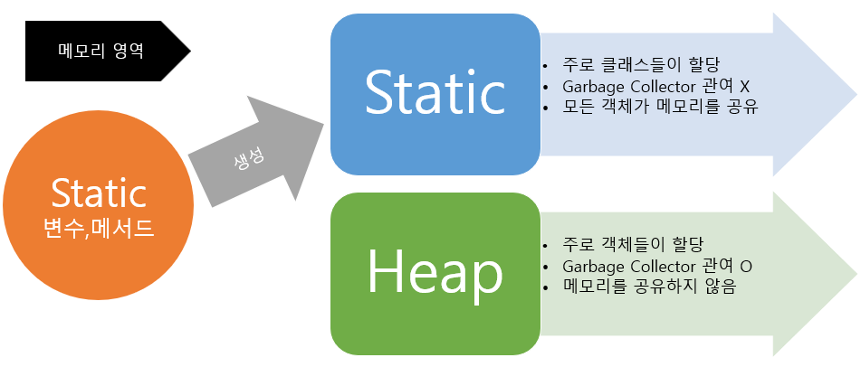
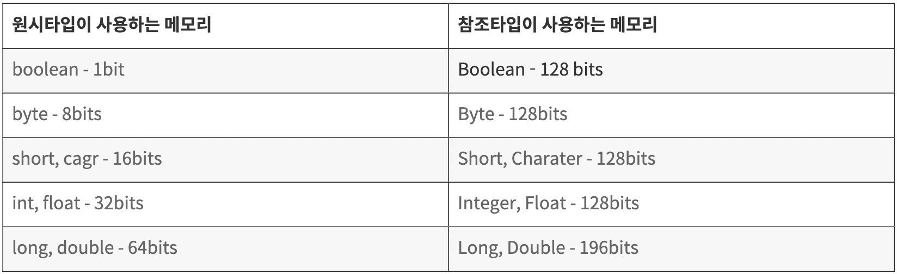

- [리터럴(Literal)](#리터럴literal)
- [this, this()](#this-this)
- [super, super()](#super-super)
- [final, static, static final](#final-static-static-final)
- [자바의 원시 타입 참조 타입](#자바의-원시-타입-참조-타입)

## 리터럴(Literal)

### 리터럴(Literal)이란?

자바에서 리터럴은 상수를 뜻한다. 이는 상수 변수에 할당될 수 있다. 리터럴은 고정된 값을 나타내며 수정이 불가능하다. 리터럴은 boolean, character, numeric, string 데이터의 문법적 표현이다.

```java
int count = 0;
```

위의 코드에서 `int count`는 int 타입의 변수이고 `0`은 리터럴이다.

### 리터럴의 종류

1. 정수 리터럴 Integral Literals<br/>
   정수 리터럴은 일반적인 십진수 ex.1,2,6,9 와 8진수, 16진수, Binary까지 포함된다.

   ```java
   int count = 987;

   int octalVal= 007;

   int hexaVal = 0x7e4;

   int binary = 0b11010;
   ```

2. 부동소수점 리터럴 Floating-Point Literals<br/>
   부동 소수점 리터럴은 소수점 이하의 값을 가지는 값이다. float 형식(4 bytes)은 끝에 **f**또는 **F**를 붙여서 나타내고, double 형식(8 bytes)은 끝에 **d** 또는 **D**를 붙여서 나타낸다. d나 f를 붙이지 않고 나타내는 decimal 형식도 있고 이 decimal 형식은 **-**나 **e**, **E**와 같이 exponent 기호와 함께 사용될 수 있다.

   ```java
   float floatVal = 4534.99f;

   double doubleVal = 19765.567;

   float expVal = 122.32E5;
   ```

3. 문자 리터럴 Char Literals
   문자 리터럴은 escape 문자 ex. \n, \r 혹은 **'** single quote로 감싸진 문자 그리고 16진수로 표현된 unicode (from 0 to 65535)를 의미한다.

   ```java
   char alpha = 'p';
   char ch1 = '\u0021';
   char ch2 = 1456;
   ```

4. 문자열 리터럴 String Literals
   String은 **"** double quote로 감싸진 문자들의 정렬이다.

   ```java
   String str = "Java";
   ```

5. Boolean Literals
   boolean 리터럴은 **true**와 **false**, 2가지의 value만을 가지는 데이터 타입이다.

   ```java
   boolean boolVal = true;
   ```

## this, this()

this는 자기 자신을 가리키는 키워드이다.

### this

매개 변수와 객체 자신이 가지고 있는 변수의 이름이 같은 경우 이를 구분하기 위해 자신의 변수에 this를 사용한다.
static 메소드에서는 사용할 수 없다.

```java
public class Person {
    String name;
    int age;
    String phone;

    public Person(String name, int age, String phone) {
        this.name = name;
        this.age = age;
        this.phone = phone;
    }
}
```

위와 같이 생성자 함수 혹은 setter 메소드에서 주로 사용했다.

### this()

this()는 자기 자신의 생성자를 가리키고 같은 클래스에 오버로딩된 다른 생성자를 호출할 때 사용할 수 있다.

```java
 String name;
    int age;
    String phone;

    public Person(String name){
      this(name, 24, 010-1111-2222)
    }

    public Person(String name, int age, String phone) {
        this.name = name;
        this.age = age;
        this.phone = phone;
    }

```

위의 예제는 현재 this()가 호출되고 있는 매개변수가 2개인 생성자에서 매개변수가 4개인 생성자를 호출하고 있는 경우이다.

## super, super()

super는 상속받은 부모를 가리킨다. 부모 클래스로부터 상속받은 필드나 메소드를 자식 클래스에서 참조하는 데 사용된다.

### super

```java
class Parent { int a = 10; }

class Child extends Parent {
    int a = 20;

    void display() {
        System.out.println(a); // 20
        System.out.println(this.a); // 20
        System.out.println(super.a); // 10

    }

}
```

위의 예시와 같이 super 키워드를 사용하면 부모의 필드를 참조할 수 있다.

### super()

`super()`는 부모의 생성자를 호출할 때 사용된다.
만약 부모에서 기본 생성자가 아닌 매개변수를 가지는 생성자를 하나라도 선언했다면 자식 클래스에서도 동일한 매개변수를 갖는 생성자를 선언해주어야 한다. 이때 super() 사용할 있다.

```java
class Parent {
    int a;
    Parent(int n) {
       a = n;
    }
}

class Child extends Parent {
    int b;
    Child() {
        super();
        b = 20;
    }
}
```

위와 같이 수정하면 부모 클래스의 멤버에 대한 초기화 코드를 중복하여 작성해주지 않아도 된다.

## final, static, static final

### final

final은 최종적인 이라는 뜻으로 한번 값이 저장되면 변경이 안된다는 의미이다.

```java
public class Shop{

  final int closeTime = 21;
  final int openTime;

  public Shop(int openTime){
    this.openTime = openTime;
  }
}

```

위의 예제는 가게는 오픈시간은 Shop이라는 인스턴스를 생성하면서 정할 수 있지만 변경가능한 closeTime과는 다르게 한번 저장된 후에는 변경이 불가능하다.

#### final 변수

변수에 `final`을 붙이면 이 변수는 수정할 수 없다는 의미가 된다. 수정할 수 없기 때문에 초기화가 필수적이고 생성자, static 메소드를 이용한 초기화도 허용된다.

초기화한 후 변경하려고 하면 compile 에러가 난다.

```java
final String hello = "Hello world";

hello = "See you around" // compile error!
```

#### final arguments

final로 선언된 인자는 메소드 내에서 변경이 불가능하다. 따라서 다음과 같이 final int로 선언한 number는 읽을 수 있지만, number = 2처럼 값을 변경하려고 하면 컴파일 에러가 발생한다.

```java
public void func(final int number) {
    System.out.println(number);

    number = 2; // compile error!
}
```

#### final class

클래스에 final을 붙이면 다른 클래스가 상속할 수 없는 클래스가 된다. 다음과 같이 final 클래스를 상속하려고 하면 컴파일 에러 발생한다.

```java
final class Person {
    final String name;
    Person() {
        this.name = "Chaerin";
    }
}

class Student extends Person() { // compile error!
}

```

#### final method

final 메소드는 Override가 안되도록 한다. 예를 들어 다음과 같이 Person 클래스를 상속하는 Student 클래스에서는 sayHi()를 재정의할 수 없다. Override하려고 하면 컴파일 에러가 발생한다.

```java
public class Person {
    final String sayHi() {
        return "hi";
    }
}

class Student extends Person() {
  @Override
  String sayHi() { // compile error !
    return "See you";
  }
}

```

### static

static 멤버는 클래스에 고정된 멤버로서 객체를 생성하지 않고 사용할 수 있는 필드와 메서드를 말한다.



Static 키워드를 통해 생성된 정적멤버들은 Heap영역이 아닌 Static영역에 할당됩니다. Static 영역에 할당된 메모리는 모든 객체가 공유하여 하나의 멤버를 어디서든지 참조할 수 있는 장점을 가지지만 Garbage Collector의 관리 영역 밖에 존재하기에 Static영역에 있는 멤버들은 프로그램의 종료시까지 메모리가 할당된 채로 존재하게 된다. 그렇기에 Static을 너무 남발하게 되면 만들고자 하는 시스템 성능에 악영향을 줄 수 있다.

#### static field 사용 예시

```java
class Number{
    static int num = 0; //클래스 필드
    int num2 = 0; //인스턴스 필드
}

public class Static_ex {

    public static void main(String[] args) {
    	Number number1 = new Number(); //첫번째 number
    	Number number2 = new Number(); //두번쨰 number

    	number1.num++; //클래스 필드 num을 1증가시킴
    	number1.num2++; //인스턴스 필드 num을 1증가시킴
    	System.out.println(number2.num); //두번째 number의 클래스 필드 출력
    	System.out.println(number2.num2); //두번째 number의 인스턴스 필드 출력

      //출력결과: 1 0
    }
}
```

위의 예시의 출력결과가 1, 0 인 이유는 static 변수는 static 공간에 할당되어 모든 instance들이 공유하기 때문에 number1에서 증가시킨 value가 남아있게 된다.

```java
class Name{
    static void print() { //클래스 메소드
	    System.out.println("내 이름은 홍길동입니다.");
    }

    void print2() { //인스턴스 메소드
	    System.out.println("내 이름은 이순신입니다.");
    }
}

public class Static_ex {

    public static void main(String[] args) {
        Name.print(); //인스턴스를 생성하지 않아도 호출이 가능

        Name name = new Name(); //인스턴스 생성
        name.print2(); //인스턴스를 생성하여야만 호출이 가능
    }
}
```

위의 예시와 같이 static 메소드는 따로 인스턴스를 생성하지 않고 `클래스이름.메소드이름` 으로 사용할 수 있다.

#### 🚨 static과 관련하여 발생했던 이슈

```java
  @Value("${api-key}")
  static private String accessKey;
```

위와 같이 application.properties에 있는 api-key값을 가지고 오는 과정에서 멤버 필드를 static으로 정의했을 때 값이 null로 들어오는 이슈가 있었다. application.properties 파일이 읽히기 전에 클래스가 로드되기 때문에 api-key의 value가 null로 들어왔고 static 영역에 메모리가 할당되어 이후에 변경이 일어나지 않은 것이다. 만일 static이 없다면 instance가 생성될 때 해당 값을 application.properties에서 읽어오기 때문에 정상작동한다.

### static final

static final은 static 영역에 할당되며 수정불가능 하다는 뜻이므로 상수를 선언할 때 사용된다.

```java
static final double PI = 3.141592;
```

`PI` 변수는 객체마다 저장될 필요없고 하나의 값만을 가질 수 있다.

## 자바의 원시 타입, 참조 타입

자바의 숫자를 다루기 위한 타입은 원시타입(Primitive type), 참조타입(Reference type) 크게 두가지로 나뉜다.

1. 원시타입

> int, double, boolean...

2. 참조타입

> Integer, Double, Boolean...

```java
int i = Integer.valueOf(1);
Integer integer = i;
```

사실 원시타입과 참조타입은 함께 사용해도 오토박싱, 언박싱이 되기 때문에 함께 사용해도 큰 어려움이 없다.

그러나 이 둘은 실제 코드 구현 시에 차이가 있다.

1. Null 할당 가능 여부

   ```java
   int i = null;//불가능
   Integer integer = null; //가능

   ```

위의 예시와 같이 원시타입은 null을 할당할 수 없다.

2. Generic 타입에서의 사용

   ```java
   List<int> i;//불가능
   List<Integer> integer;//가능
   ```

이런 차이가 생기는 이유는 원시타입은 Stack 메모리에 값이 존재하고, 참조타입은 하나의 인스턴스이기 때문에 다른 클래스 인스턴스들과 마찬가지로 Stack에는 참조값만 존재하고 실제값은 힙메모리에 존재하기 때문이다.

그렇기 때문에 성능에서 차이가 발생한다.

1. 접근속도 <br/>
   Stack에 바로 값이 존재하는 원시타입은 접근속도가 빠르다. 반면 참조타입은 stack에는 참조값만 있고 실제 값은 heap 영역에 존재하기 때문에 값을 필요로 할 때마다 언박싱의 과정을 거쳐야한다. 그렇기에 참조타입의 접근속도는 원시타입의 접근속도보다 느리다.

   <br/>

2. 차지하는 메모리의 양 <br/>
   차지하는 메모리의 양도 참조타입이 원시타입보다 많다.
   

Null을 할당해야 하거나 제네릭 타입으로 사용하는 경우에는 원시타입을 그렇지 않은 경우에는 원시타입을 사용하면 된다.
