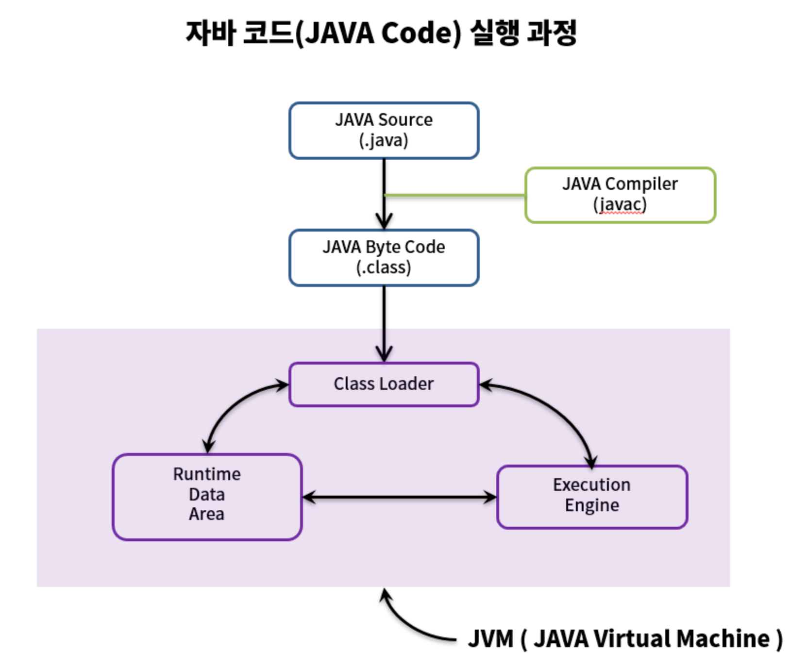

# 자바의 컴파일 과정



1. 개발자가 자바 소스코드(.java)를 작성한다.

2. 자바 컴파일러가 자바 소스코드(.java)파일을 읽어 바이트코드(.class)코드로 컴파일 한다. 바이트코드(.class)파일은 아직 컴퓨터가 읽을 수 없는 JVM(자바 가상 머신)이 읽을 수 있는 코드이다. (java - > class)

3. 컴파일된 바이트코드(.class)를 JVM의 클래스로더(Class Loader)에게 전달한다.

4. 클래스 로더는 동적로딩(Dynamic Loading)을 통해 필요한 클래스들을 로딩 및 링크하여 런타임 데이터 영역(Runtime Data area), 즉 JVM의 메모리에 올린다.

   **클래스 로더 세부 동작**

   로드 : 클래스 파일을 가져와서 JVM의 메모리에 로드한다.

   검증 : 자바 언어 명세(Java Language Specification) 및 JVM 명세에 명시된 대로 구성되어 있는지 검사한다.

   준비 : 클래스가 필요로 하는 메모리를 할당한다. (필드, 메서드, 인터페이스 등등)

   분석 : 클래스의 상수 풀 내 모든 심볼릭 레퍼런스를 다이렉트 레퍼런스로 변경한다.

   초기화 : 클래스 변수들을 적절한 값으로 초기한다. (static 필드)

5. 실행엔진(Execution Engine)은 JVM 메모리에 올라온 바이트 코드들을 명령어 단위로 하나씩 가져와서 실행한다. 이 때 실행 엔진은 두 가지 방식으로 변경한다

   1. 인터프리터 : 바이트 코드 명령어를 하나씩 읽어서 해석하고 실행한다. 하나하나의 실행은 빠르나, 전체적인 실행 속도가 느리다는 단점을 가진다.

   2. JIT컴파일러 : 인터프리터의 단점을 보완하기 위해 도입된 방식으로 바이트 코드 전체를 컴파일하여 바이너리 코드로 변경하고 이후에는 해당 메서드를 더이상 인터프리팅 하지 않고, 바이너리 코드로 직접 실행하는 방식한다. 하나씩 인터프리팅하여 실행하는 것이 아니라 바이트 코드 전체가 컴파일된 바이너리 코드를 실행하는 것이기 때문에 전체적인 실행속도는 인터프리팅 방식보다 빠르다.

# Builder Pattern

## 빌더 패턴을 사용하는 이유

- 불필요한 생성자를 만들지 않고, 객체를 생성
- 데이터의 순서에 상관없이 객체를 생성
- 명시적이고, 이해하기 쉬움
- 유지 보수가 편함

즉 빌더 패턴은 객체 생성을 깔끔하고, 유연하게 하기 위한 기법

점층적 생성자 패턴이나, 자바빈 패턴의 대안으로 나온 것이 빌더 패턴이다.
빌더 패턴이 나오게 된 이유를 먼저 살펴보자.

## 점층적 생성자 패턴

```java
public class Post {

    private String title;
    private String content;
    private LocalDateTime date;

    // 점층적 생성자 패턴
    public Post() {

    }

    public Post(String title) {
        this.title = title;
    }

    public Post(String title, String author) {
        this.title = title;
        this.author = author;
    }

    public Post(String title, String author, LocalDateTime date) {
        this.title = title;
        this.author = author;
        this.date = date;
    }
}
```

test

```java
@SpringBootTest
public class BuilderPatternTest {
  @Test
  public void Test() {
    Post Post1 = new Post("홍길동전");
    Post Post2 = new Post("홍길동전","허균");
    Post Post3 = new Post("홍길동전","허균",LocalDateTime.now());
    Post Post4 = new Post("홍길동전","허균",LocalDateTime.now(),0);
  }
}
```

**단점**

다른 생성자를 호출하는 생성자가 많아질 경우, 인자가 추가될 때 코드 수정이 어렵다.
코드 가독성이 떨어진다 (인자 수가 많은 생성자의 경우, 코드만 보고 의미를 해석하기 어렵다.)

## 자바빈 패턴

```java
public class Post {

    private String title;
    private String content;
    private LocalDateTime date;

    // 자바빈 패턴
     public String getTitle() {
        return this.title;
    }

    public void setTitle(String title) {
        this.title = title;
    }

    public String getAuthor() {
        return this.author;
    }

    public void setAuthor(String author) {
        this.author = author;
    }

    public LocalDateTime getDate() {
        return this.publishedAt;
    }

    public void setDate(LocalDateTime publishedAt) {
        this.publishedAt = publishedAt;
    }

}
```

```java
@SpringBootTest
public class BuilderPatternTest {
  @Test
  public void Test() {
    Post post = new Post();
    post.setTitle("홍길동전");
    post.setAuthor("허균");
    post.setPublishedAt(LocalDateTime.now());
    post.setPageCount(0);
  }
}
```

**단점**

- 객체 일관성이 깨진다 : 1회의 호출로 객체 생성이 끝나지 않는다. (한번 생성한 객체에 값을 계속 세팅함)
- 변경 불가능 클래스를 만들 수가 없음 : 스레드 안전성을 확보하려면 점층적 패턴보다 많은 일을 해야한다.

이런 점층적 생성자 패턴과 자바빈 패턴의 대안으로 나온 것이 Builder pattern이다.

## Builder 패턴

```java
public Book(BookBuilder bookBuilder) {
        title = bookBuilder.title;
        author = bookBuilder.author;
        publishedAt = bookBuilder.publishedAt;
        pageCount = bookBuilder.pageCount;
    }

    public static class BookBuilder {
        //필수 인자
        private String title;

        //선택적 인자
        private String author = "";
        private LocalDateTime publishedAt = LocalDateTime.now();
        private int pageCount = 0;

        public BookBuilder (String title) {
            this.title = title;
        }

        public BookBuilder author(String value) {
            author = value;
            return this;    //return this로 하면 .으로 인자를 연속적으로 세팅할 수 있다.
        }

        public BookBuilder publishedAt(LocalDateTime value) {
            publishedAt = value;
            return this;
        }

        public BookBuilder title(int value) {
            pageCount = value;
            return this;
        }

        public Book build() {
            return new Book(this);
        }
    }
```

```java
@SpringBootTest
public class BuilderPatternTest {
  @Test
  public void Test() {
    Book book6 = new Book.BookBuilder("홍길동전")
                        .author("허균")
                        .build();

  }
}
```

이러한 빌드 패턴은 lombok의 @Builder 어노테이션을 이용해 간단히 구현이 가능하다.

```java
@Builder
public class User {
    private String title;
    private String author = "";
    private LocalDateTime date = LocalDateTime.now();
    private int pageCount = 0;
}
```

```java
User bag = Bag.builder()
		    .title("title")
        	.author("author")
        	.build();
```
