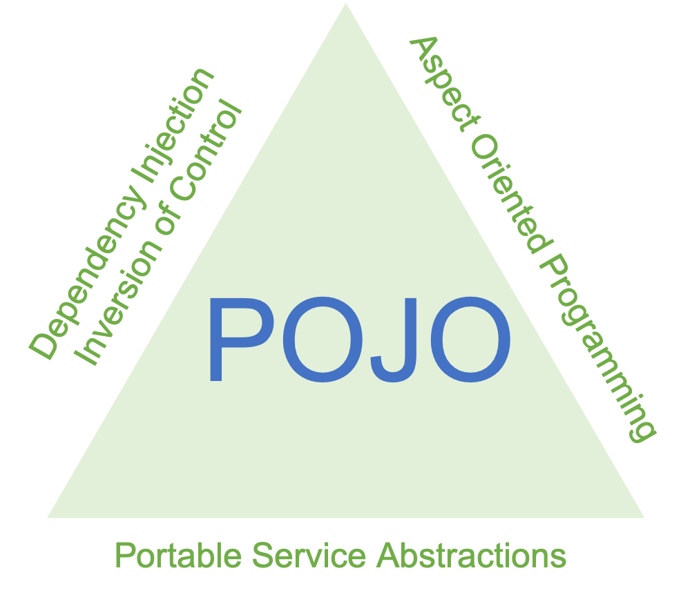

# Spring의 4가지 특징



## 1. POJO 프로그래밍 지향 (Plane Old Java Object)

### POJO의 의미

> Plain Old Java Object, 간단히 POJO는 말 그대로 해석을 하면 오래된 방식의 간단한 자바 오브젝트라는 말로서 Java EE 등의 중량 프레임워크들을 사용하게 되면서 해당 프레임워크에 종속된 "무거운" 객체를 만들게 된 것에 반발해서 사용되게 된 용어이다.

다른 말로 정리하자면 POJO란, 객체 지향적인 원리에 충실하면서 환경과 기술에 종속되지 않고 필요에 따라 재사용될 수 있는 오브젝트를 말한다.

```java
public class EmployeePojo {

    public String firstName;
    public String lastName;
    private LocalDate startDate;

    public EmployeePojo(String firstName, String lastName, LocalDate startDate) {
        this.firstName = firstName;
        this.lastName = lastName;
        this.startDate = startDate;
    }

    public String name() {
        return this.firstName + " " + this.lastName;
    }

    public LocalDate getStart() {
        return this.startDate;
    }
}
```

위의 예시는 어떤 프레임워크에도 종속되지 않고 어떤 자바프로그램에서든 사용가능한 클래스이기 때문에 POJO이다.

## 2. IoC / DI (Inversion of Control & Dependency Injection)

## 3. AOP (Aspect Oriented Programming)

AOP는 **Aspect Oriented Programming**의 약자로 관점 지향 프로그래밍이라고 불린다. 흩어진 Aspect들을 모아서 모듈화하여 코드의 중복을 줄이는 프로그래밍 기법이다.


위의 이미지와 같이 class A, B, C가 있고 각각의 클래스에 중복되는 기능 X, Y, Z(Crosscutting Concerns)들이 있다면 이를 Aspect라는 블럭으로 모듈화 하는 것이다.

코드를 통해 이를 어떻게 구현하는지 알아보자.

build.gradle

```groovy
implementation 'org.springframework.boot:spring-boot-starter-aop'
```

spring AOP를 사용해주려면 다음과 같이 의존성을 추가해줘야한다.

```java
@Component
@Aspect
public class PerfAspect {

}
```

Spring AOP는 Bean에서만 동작하기 때문에 `@Component` Annotation을 사용하여 스프링 Bean으로 등록하여 사용해준다.
`@Aspect` 어노테이션을 붙이면 해당 클래스가 Aspect라는 것을 명시해준다.

로그를 찍는 기능이 여러 클래스에 공통적으로 구현해야 하는 상황에서 AOP를 어떻게 활용할 수 있을지 예제를 통해 알아보자.

LogGetData.java

```java
import java.lang.annotation.ElementType;
import java.lang.annotation.Retention;
import java.lang.annotation.RetentionPolicy;
import java.lang.annotation.Target;

@Target(ElementType.METHOD)
@Retention(RetentionPolicy.RUNTIME) // Annotation을 런타임까지 사용
public @interface LogGetDate {

}
```

위 코드는 @LogGetData라는 annotation을 만들어주기 위한 코드이다.

LogAspect.java

```java
import org.aspectj.lang.ProceedingJoinPoint;
import org.aspectj.lang.annotation.Around;
import org.aspectj.lang.annotation.Aspect;
import org.aspectj.lang.annotation.Pointcut;
import org.slf4j.Logger;
import org.slf4j.LoggerFactory;
import org.springframework.stereotype.Component;
import java.util.Date;

@Component
@Aspect
public class LogAspect {

	Logger logger = LoggerFactory.getLogger(LogAspect.class); // log

	@Around("@annotation(LogGetDate)") // method 실행 되는 전 과정
	public Object logGetDate(ProceedingJoinPoint joinPoint) throws Throwable {
		Date date = new Date();
		date.getTime(); // 메소드가 실행되는 현재 시간

		Object ret = joinPoint.proceed();

		logger.info(date.toString());

		return ret;
	}
}
```

위의 코드는 LogAspect라는 Aspect를 생성하였고 LogGetData라는 어노테이션이 붙은 method가 실행 되기 전 logGetDate라는 메소드가 실행되는 코드이다.

```java
@GetMapping("/owners/find")
@LogGetDate
public String initFindForm(Map<String, Object> model) {
    model.put("owner", new Owner());
    return "owners/findOwners";
}
```

위의 코드에서 보면 다음 getAPI가 호출될 때 @LogGetDate 어노테이션이 붙어있으므로 LogAspect가 불리고 initFindForm이 실행되기 전 logGetDate 메소드가 실행되게 된다.

## 4. PSA (Portable Service Abstraction)

# Spring의 동작과정
